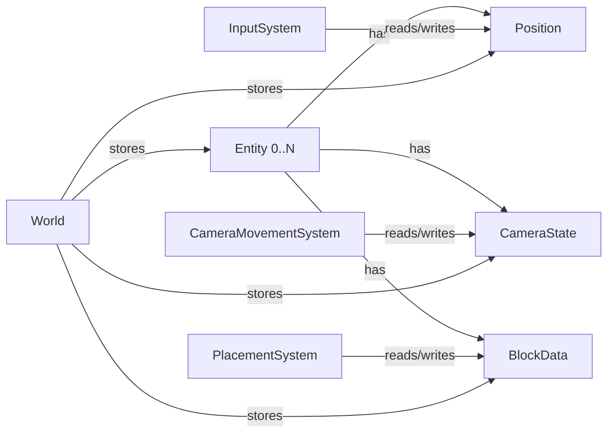
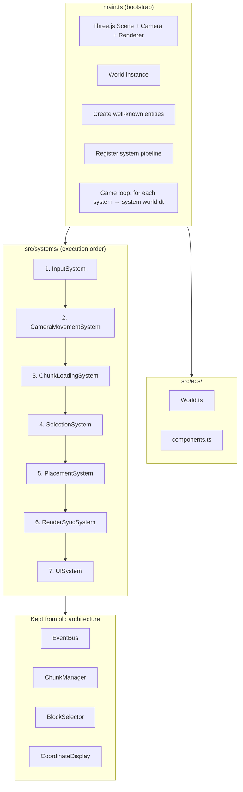
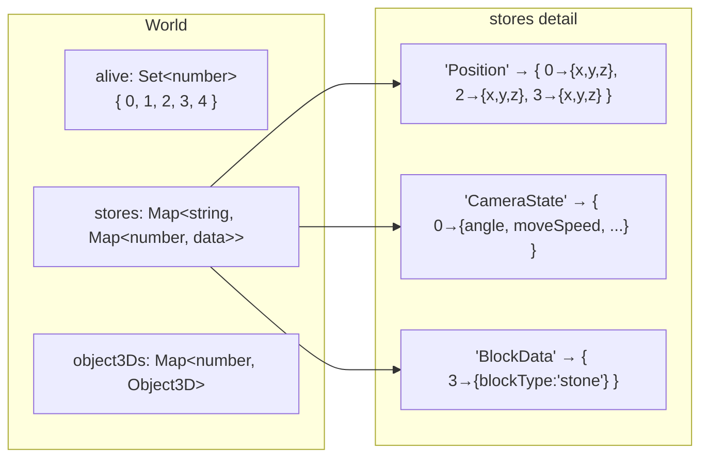
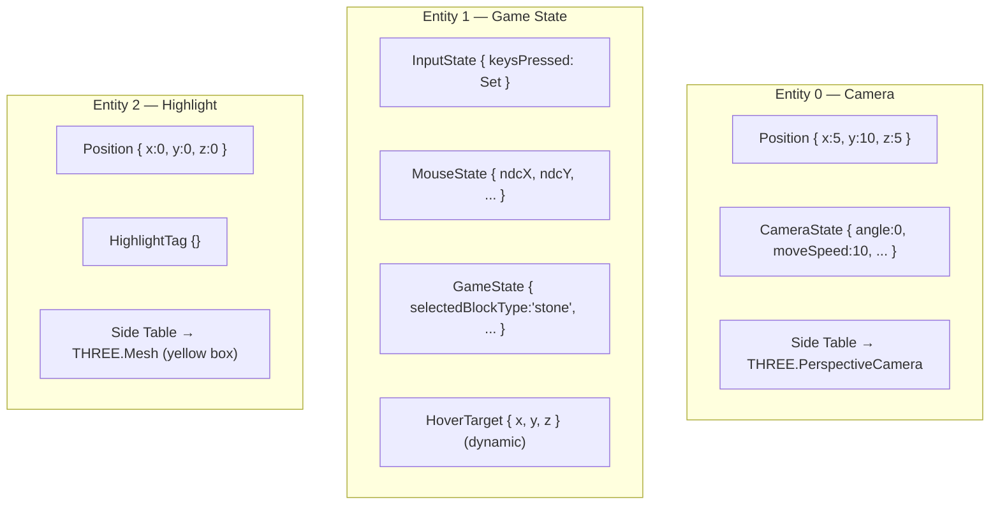
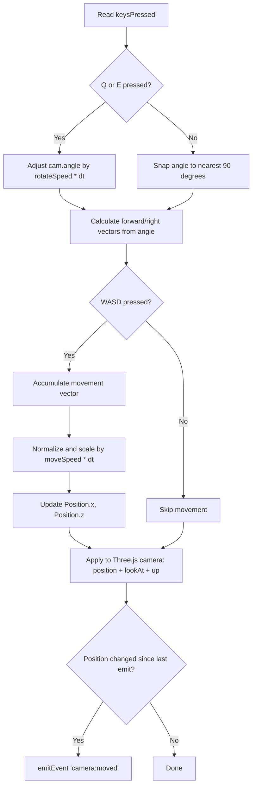
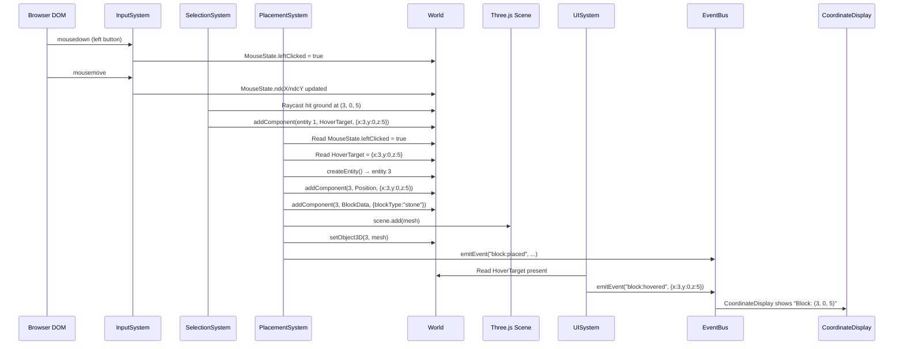
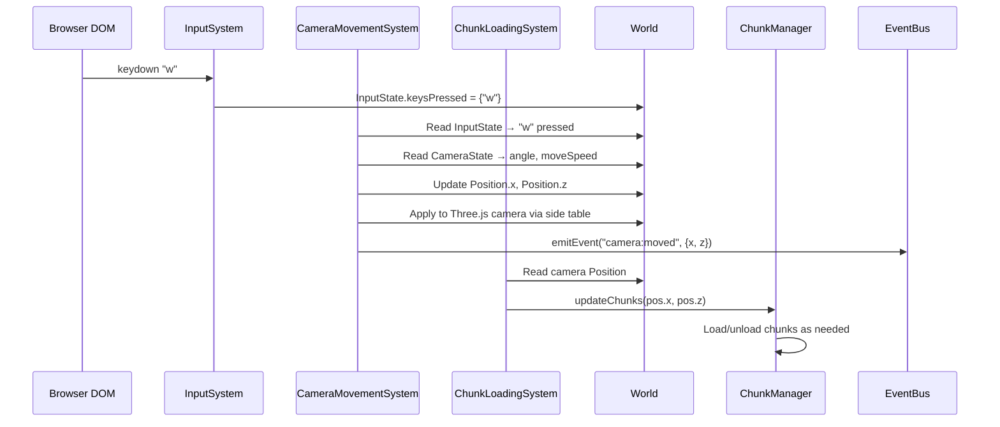
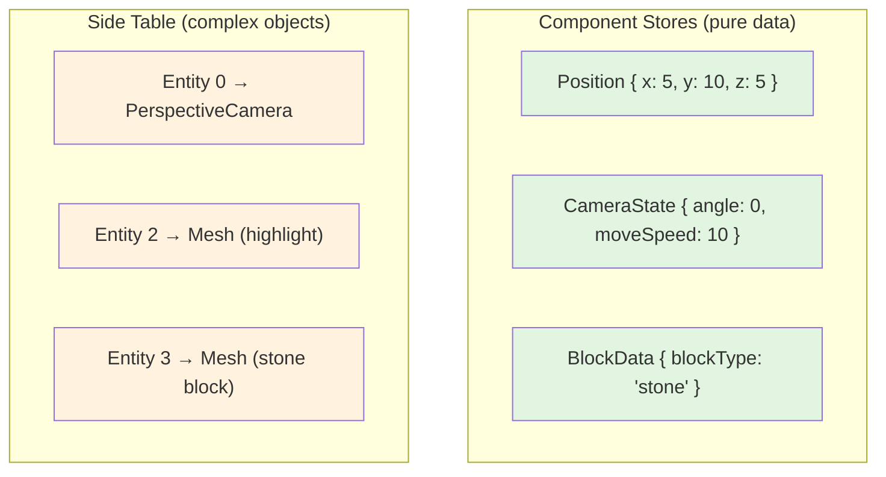
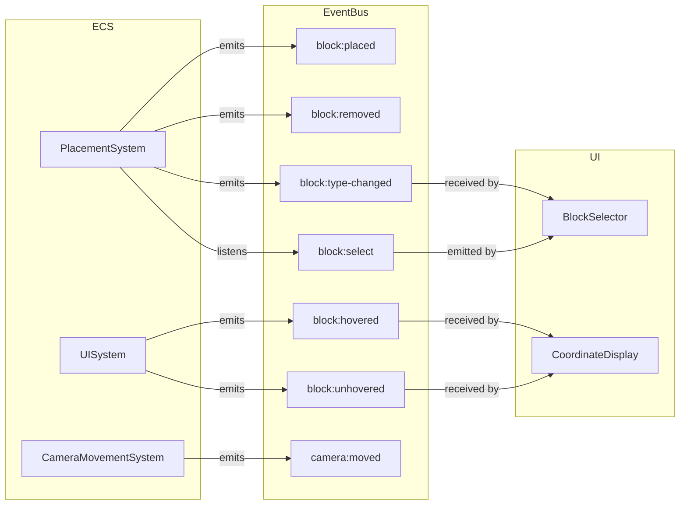

# Entity Component System (ECS) Architecture

A custom ECS built from scratch for a Three.js voxel game. No external ECS library — every piece lives in `src/ecs/` and `src/systems/`.

---

## Table of Contents

1. [What is ECS and Why](#what-is-ecs-and-why)
2. [Architecture Overview](#architecture-overview)
3. [Core: The World](#core-the-world)
4. [Components](#components)
5. [Well-Known Entities](#well-known-entities)
6. [System Pipeline](#system-pipeline)
7. [System Reference](#system-reference)
8. [Data Flow](#data-flow)
9. [The Object3D Side Table](#the-object3d-side-table)
10. [EventBus Bridge](#eventbus-bridge)
11. [Extending the ECS](#extending-the-ecs)
12. [File Map](#file-map)

---

## What is ECS and Why

ECS separates **identity** (entities), **data** (components), and **logic** (systems):

| Concept | What it is | In our code |
|---------|-----------|-------------|
| **Entity** | A numeric ID — nothing more | `number` (0, 1, 2, 3...) |
| **Component** | A plain data object attached to an entity | `Position { x, y, z }` |
| **System** | A function that runs every frame, reading/writing components | `(world, dt) => void` |

The previous class-based architecture had `CameraController`, `SelectionSystem`, `PlacementSystem` etc. as classes holding both state and logic. ECS pulls these apart: state lives in components, logic lives in systems, and the World wires them together.



---

## Architecture Overview



---

## Core: The World

**File:** `src/ecs/World.ts`

The `World` class is the single container for all ECS state. It manages entities, component stores, queries, and a Three.js side table.

### Internal Data Structures



### API Reference

#### Entity Lifecycle

```typescript
// Create a new entity — returns an auto-incrementing numeric ID
const id = world.createEntity(); // 0, 1, 2, 3...

// Check if an entity is alive
world.isAlive(id); // true

// Destroy an entity — removes it from all component stores and the side table
world.destroyEntity(id);
world.isAlive(id); // false
```

#### Component Operations

```typescript
import { POSITION, type Position } from "./ecs/components";

// Attach a component to an entity
world.addComponent<Position>(id, POSITION, { x: 0, y: 10, z: 0 });

// Read a component (returns the same object reference — mutations are visible)
const pos = world.getComponent<Position>(id, POSITION);
pos.x += 5; // directly mutates the stored data

// Check existence
world.hasComponent(id, POSITION); // true

// Remove a component
world.removeComponent(id, POSITION);
world.hasComponent(id, POSITION); // false
```

> **Important:** `getComponent` returns a direct reference to the stored object. Mutating the returned value mutates the component in-place. This is intentional — systems read and write components by reference.

#### Queries

```typescript
// Find all entities that have BOTH Position and BlockData
const blockEntities = world.query(POSITION, BLOCK_DATA);
// Returns: [3, 4, 5] (entity IDs)

// Iterate and process
for (const id of blockEntities) {
  const pos = world.getComponent<Position>(id, POSITION);
  const block = world.getComponent<BlockData>(id, BLOCK_DATA);
  // ...
}
```

`query()` does a linear scan of all alive entities and checks `hasComponent` for each requested name. For our entity counts (dozens, not thousands) this is more than fast enough.

#### Object3D Side Table

```typescript
// Associate a Three.js object with an entity
world.setObject3D(id, mesh);

// Retrieve it (returns undefined if not set)
const mesh = world.getObject3D(id) as THREE.Mesh;

// Remove the association (does NOT remove from the Three.js scene)
world.removeObject3D(id);
```

The side table is separate from component stores because Three.js objects are not plain data — they're complex class instances with circular references, methods, and GPU resources. Keeping them out of the component stores keeps components simple and serializable.

---

## Components

**File:** `src/ecs/components.ts`

Every component is a TypeScript interface (pure data) plus a string constant used as the store key.

### Component Table

| Constant | Interface | Fields | Purpose |
|----------|-----------|--------|---------|
| `POSITION` | `Position` | `x, y, z` | World-space position |
| `CAMERA_STATE` | `CameraState` | `angle, moveSpeed, rotateSpeed, snapAngle, snapThreshold, lastEmittedX, lastEmittedZ` | Camera rotation and movement config |
| `INPUT_STATE` | `InputState` | `keysPressed: Set<string>` | Currently held keyboard keys |
| `MOUSE_STATE` | `MouseState` | `ndcX, ndcY, leftDown, rightDown, leftClicked, rightClicked` | Mouse position (NDC) and button state |
| `BLOCK_DATA` | `BlockData` | `blockType: string` | Identifies a placed block's type |
| `HOVER_TARGET` | `HoverTarget` | `x, y, z, isGround: boolean` | What the mouse cursor is pointing at |
| `HIGHLIGHT_TAG` | `HighlightTag` | `{}` (empty) | Tag-only marker for the highlight entity |
| `GAME_STATE` | `GameState` | `selectedBlockType, buildLevel, placedBlockKeys: Map<string, number>` | Global game configuration |

### Name Constants

Components are identified by string constants rather than class types:

```typescript
export const POSITION = "Position";
export const CAMERA_STATE = "CameraState";
// ...
```

This avoids class/constructor overhead. A system imports the constant and uses it as the key:

```typescript
import { POSITION, type Position } from "../ecs/components";

const pos = world.getComponent<Position>(entityId, POSITION);
```

### Dynamic vs. Permanent Components

Most components are added once and stay for the entity's lifetime. One notable exception:

- **`HoverTarget`** is added/removed dynamically on the game state entity. When the mouse hovers a block, `SelectionSystem` adds it. When nothing is hovered, it removes it. Other systems use `world.hasComponent(GAME_STATE_ENTITY, HOVER_TARGET)` to check if something is hovered.

---

## Well-Known Entities

Three entities are created at startup with guaranteed IDs:



These IDs are exported as constants for direct access without querying:

```typescript
export const CAMERA_ENTITY = 0;
export const GAME_STATE_ENTITY = 1;
export const HIGHLIGHT_ENTITY = 2;
```

**Block entities** (ID 3+) are created dynamically when the player places blocks and destroyed when blocks are removed.

---

## System Pipeline

Systems execute in a fixed order every frame. **Order matters** — each system depends on data written by earlier systems.

```mermaid
sequenceDiagram
    participant Loop as Game Loop
    participant IS as 1. InputSystem
    participant CMS as 2. CameraMovementSystem
    participant CLS as 3. ChunkLoadingSystem
    participant SS as 4. SelectionSystem
    participant PS as 5. PlacementSystem
    participant RSS as 6. RenderSyncSystem
    participant UIS as 7. UISystem
    participant R as renderer.render()

    Loop->>IS: system(world, dt)
    Note over IS: DOM closure → InputState, MouseState

    Loop->>CMS: system(world, dt)
    Note over CMS: InputState + CameraState → Position<br/>Apply to Three.js camera

    Loop->>CLS: system(world, dt)
    Note over CLS: Camera Position → ChunkManager.updateChunks()

    Loop->>SS: system(world, dt)
    Note over SS: MouseState → Raycast → HoverTarget<br/>Position highlight mesh

    Loop->>PS: system(world, dt)
    Note over PS: MouseState + HoverTarget + GameState<br/>→ Create/destroy block entities

    Loop->>RSS: system(world, dt)
    Note over RSS: Position + BlockData → mesh.position

    Loop->>UIS: system(world, dt)
    Note over UIS: HoverTarget → EventBus events

    Loop->>R: render(scene, camera)
```

### The System Signature

Every system is a **factory function** that returns a `(world: World, dt: number) => void`:

```typescript
export function createMySystem(): (world: World, dt: number) => void {
  // One-time setup (closure variables, event subscriptions, etc.)

  return (world: World, dt: number) => {
    // Runs every frame
  };
}
```

The factory pattern allows systems to:
- Capture closure variables (e.g., DOM state, Three.js objects)
- Subscribe to events once at creation time
- Hold private state that persists across frames

### Registration in main.ts

```typescript
const systems = [
  createInputSystem(),
  createCameraMovementSystem(),
  createChunkLoadingSystem(chunkManager),
  createSelectionSystem(scene),
  createPlacementSystem(scene),
  createRenderSyncSystem(),
  createUISystem(),
];

// Game loop
function animate() {
  requestAnimationFrame(animate);
  const dt = clock.getDelta();

  for (const system of systems) {
    system(world, dt);
  }

  renderer.render(scene, camera);
}
```

---

## System Reference

### 1. InputSystem

**File:** `src/systems/InputSystem.ts`
**Reads:** DOM events (keyboard, mouse) via closure
**Writes:** `InputState`, `MouseState` on entity 1

The factory sets up all DOM event listeners and captures raw input into closure-local variables. Each frame, the returned function copies that state into ECS components.

Key design decisions:
- **`leftClicked` / `rightClicked` are one-shot flags.** They are set to `true` on `mousedown` and cleared after being written to the component. This means downstream systems see exactly one frame of `true` per click.
- **`leftDown` / `rightDown` are held flags.** They stay `true` as long as the button is held.
- **`blur` clears all keys** to prevent stuck keys when tabbing away.

### 2. CameraMovementSystem

**File:** `src/systems/CameraMovementSystem.ts`
**Reads:** `InputState` (entity 1), `CameraState` + `Position` (entity 0)
**Writes:** `Position` (entity 0), `CameraState.angle`, Three.js camera transform

Handles WASD movement and QE rotation:



The camera applies its own transform here (not in RenderSyncSystem) because it needs custom `lookAt` and `up` vector logic for the isometric view.

### 3. ChunkLoadingSystem

**File:** `src/systems/ChunkLoadingSystem.ts`
**Reads:** `Position` (entity 0)
**Calls:** `ChunkManager.updateChunks(x, z)`

The simplest system — reads the camera position and passes it to the chunk manager. The chunk manager handles the actual chunk load/unload logic internally.

### 4. SelectionSystem

**File:** `src/systems/SelectionSystem.ts`
**Reads:** `MouseState` (entity 1), Three.js camera (side table, entity 0)
**Writes:** `HoverTarget` (added/removed on entity 1), `Position` (entity 2), highlight mesh visibility

Raycasts from the camera through the mouse cursor into the scene. If a grid cell or placed block is hit, it adds a `HoverTarget` component. If nothing is hit, it removes it.

### 5. PlacementSystem

**File:** `src/systems/PlacementSystem.ts`
**Reads:** `MouseState`, `HoverTarget`, `GameState` (all entity 1)
**Writes:** Creates/destroys block entities (3+), updates `GameState.placedBlockKeys`

On left click: creates a new entity with `Position` + `BlockData`, creates a Three.js mesh, adds both to the world. On right click: looks up the entity by position key, removes the mesh from the scene, destroys the entity.

Also bridges block type selection from the EventBus (`block:select` events from the UI) into the `GameState` component.

### 6. RenderSyncSystem

**File:** `src/systems/RenderSyncSystem.ts`
**Reads:** All entities with `Position` + `BlockData`
**Writes:** Three.js `mesh.position`

Queries all block entities and syncs their ECS Position to the Three.js mesh position, adding a +0.5 Y offset (blocks are 1 unit tall, position is at the base, mesh origin is at the center).

### 7. UISystem

**File:** `src/systems/UISystem.ts`
**Reads:** `HoverTarget` presence (entity 1)
**Writes:** EventBus events (`block:hovered`, `block:unhovered`)

Bridges ECS state to the EventBus so that legacy UI components (`CoordinateDisplay`, `BlockSelector`) continue to work without knowing about the ECS.

---

## Data Flow

### Block Placement Flow



### Camera Movement Flow



---

## The Object3D Side Table

Three.js meshes, cameras, and other `Object3D` instances are stored in a separate `Map<EntityId, THREE.Object3D>` rather than as components. This is a deliberate design decision:



**Why separate?**
- Components are meant to be simple, serializable data. Three.js objects have methods, circular references, GPU resources.
- `destroyEntity()` automatically cleans up the side table entry alongside all components.
- Systems that need the Three.js object explicitly call `world.getObject3D(id)` — the intent is clear.

---

## EventBus Bridge

The ECS doesn't replace the EventBus — it works alongside it. The EventBus remains the communication channel for UI components that don't participate in the ECS.



**Inbound bridge:** `PlacementSystem` subscribes to `block:select` in its factory closure and writes the selection into `GameState` each frame.

**Outbound bridge:** `UISystem` reads `HoverTarget` presence and emits `block:hovered`/`block:unhovered`. `PlacementSystem` emits `block:placed`/`block:removed`. `CameraMovementSystem` emits `camera:moved`.

---

## Extending the ECS

### Adding a New Component

1. Define the interface and name constant in `src/ecs/components.ts`:

```typescript
// Name constant
export const HEALTH = "Health";

// Data interface
export interface Health {
  current: number;
  max: number;
}
```

2. Optionally add it to `ComponentTypeMap` for type-safe lookups:

```typescript
export interface ComponentTypeMap {
  // ... existing entries ...
  [HEALTH]: Health;
}
```

3. Attach it to entities:

```typescript
import { HEALTH, type Health } from "./ecs/components";

world.addComponent<Health>(entityId, HEALTH, { current: 100, max: 100 });
```

### Adding a New System

1. Create a new file in `src/systems/`:

```typescript
// src/systems/HealthSystem.ts
import { World } from "../ecs/World";
import { HEALTH, POSITION, type Health, type Position } from "../ecs/components";

export function createHealthSystem(): (world: World, dt: number) => void {
  // One-time setup here (if needed)

  return (world: World, dt: number) => {
    // Query all entities that have Health
    const entities = world.query(HEALTH);

    for (const id of entities) {
      const health = world.getComponent<Health>(id, HEALTH);
      if (!health) continue;

      if (health.current <= 0) {
        // Entity died — destroy it
        const mesh = world.getObject3D(id);
        if (mesh) {
          // Remove from Three.js scene if needed
          mesh.removeFromParent();
        }
        world.destroyEntity(id);
      }
    }
  };
}
```

2. Register it in `main.ts` at the appropriate position in the pipeline:

```typescript
import { createHealthSystem } from "./systems/HealthSystem";

const systems = [
  createInputSystem(),
  createCameraMovementSystem(),
  createChunkLoadingSystem(chunkManager),
  createSelectionSystem(scene),
  createPlacementSystem(scene),
  createHealthSystem(),        // ← added here
  createRenderSyncSystem(),
  createUISystem(),
];
```

### Adding a New Entity Type

Create the entity and attach components in `main.ts` (or in a system):

```typescript
// Example: an NPC entity
const npc = world.createEntity();
world.addComponent<Position>(npc, POSITION, { x: 10, y: 0, z: 10 });
world.addComponent<Health>(npc, HEALTH, { current: 50, max: 50 });

// Create a Three.js mesh for it
const npcMesh = new THREE.Mesh(someGeometry, someMaterial);
npcMesh.position.set(10, 0.5, 10);
scene.add(npcMesh);
world.setObject3D(npc, npcMesh);
```

The entity will automatically be picked up by any system that queries for its components. For example, `RenderSyncSystem` queries `POSITION + BLOCK_DATA` — the NPC won't match because it lacks `BLOCK_DATA`. If you want it synced, either add `BlockData` or write a separate sync system.

### Adding a System With External Dependencies

Pass dependencies into the factory function:

```typescript
export function createChunkLoadingSystem(
  chunkManager: ChunkManager   // ← injected dependency
): (world: World, dt: number) => void {
  return (world: World, _dt: number) => {
    const pos = world.getComponent<Position>(CAMERA_ENTITY, POSITION);
    if (!pos) return;
    chunkManager.updateChunks(pos.x, pos.z);
  };
}
```

### Using Tag Components

A tag is an empty component used purely for identification:

```typescript
export const ENEMY_TAG = "EnemyTag";
export interface EnemyTag {}

// Attach
world.addComponent<EnemyTag>(id, ENEMY_TAG, {});

// Query all enemies
const enemies = world.query(ENEMY_TAG, POSITION);
```

This is how `HighlightTag` works — it marks entity 2 as the highlight so systems can find it by query if needed.

### Toggling Behavior With Component Presence

Instead of boolean flags, add/remove a component to toggle behavior:

```typescript
// SelectionSystem: adds HoverTarget when mouse is over something
world.addComponent(GAME_STATE_ENTITY, HOVER_TARGET, { x, y, z, isGround });

// SelectionSystem: removes it when nothing is hovered
world.removeComponent(GAME_STATE_ENTITY, HOVER_TARGET);

// PlacementSystem: checks presence instead of a boolean
if (world.hasComponent(GAME_STATE_ENTITY, HOVER_TARGET)) {
  // Something is hovered — safe to read the component
  const hover = world.getComponent<HoverTarget>(GAME_STATE_ENTITY, HOVER_TARGET);
}
```

---

## File Map

```
src/
├── main.ts                              Entry point: scene, entities, systems, game loop
├── ecs/
│   ├── World.ts                         Core ECS class: entities, stores, queries, side table
│   └── components.ts                    All component interfaces + name constants
├── systems/
│   ├── InputSystem.ts                   DOM events → InputState, MouseState
│   ├── CameraMovementSystem.ts          WASD/QE → camera Position + Three.js transform
│   ├── ChunkLoadingSystem.ts            Camera Position → ChunkManager.updateChunks()
│   ├── SelectionSystem.ts               Raycast → HoverTarget + highlight mesh
│   ├── PlacementSystem.ts               Click + HoverTarget → create/destroy block entities
│   ├── RenderSyncSystem.ts              Position + BlockData → mesh.position sync
│   └── UISystem.ts                      HoverTarget → EventBus for UI components
├── core/
│   ├── EventBus.ts                      Pub/sub for UI communication
│   └── EventTypes.ts                    Event interface definitions
├── grid/
│   ├── Chunk.ts                         Single 8x8 terrain chunk
│   └── ChunkManager.ts                  Chunk loading/unloading around camera
├── structures/
│   └── BlockTypes.ts                    Block type definitions + shared materials
└── ui/
    ├── BlockSelector.ts                 Block type selector (keys 1-5)
    └── CoordinateDisplay.ts             Shows hovered block coordinates
```
