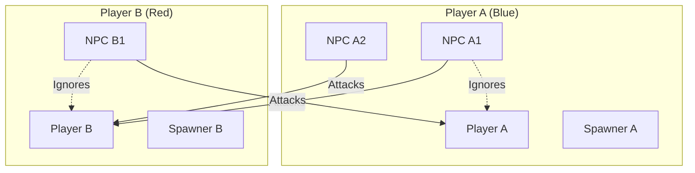
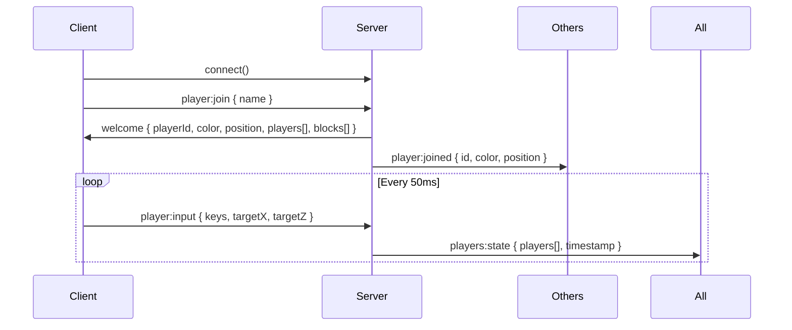
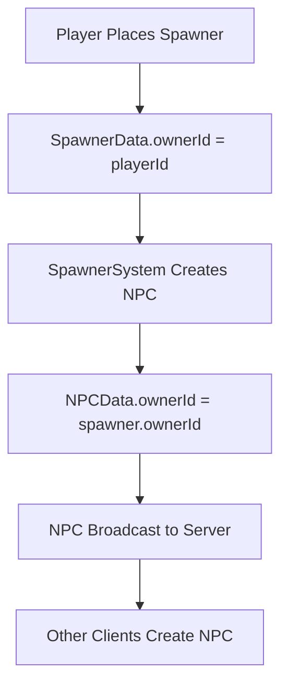

# Multiplayer System

A guide to the multiplayer implementation using Socket.IO. Players can build barricades, spawn friendly units, and those units will attack other players (not their owner).

---

## Table of Contents

1. [Overview](#overview)
2. [Architecture](#architecture)
3. [Running Multiplayer](#running-multiplayer)
4. [Server Implementation](#server-implementation)
5. [Client Implementation](#client-implementation)
6. [Entity Ownership](#entity-ownership)
7. [State Synchronization](#state-synchronization)
8. [NPC Targeting](#npc-targeting)
9. [Configuration](#configuration)
10. [File Reference](#file-reference)

---

## Overview

### Features

- **Multiple players** connect via Socket.IO (port 1340)
- **Random spawn positions** within 30 block radius of origin
- **Player colors** assigned automatically (blue, red, green, orange, purple, teal, pink, cyan)
- **Entity ownership** - spawners and NPCs track their owner
- **Friendly NPCs** - NPCs don't attack their owner
- **Enemy targeting** - NPCs attack other players
- **Block sync** - placed/removed blocks sync across all clients
- **NPC sync** - spawned NPCs appear on all clients
- **Camera zoom** - UI slider to control camera height (5-30)



---

## Architecture

```
┌─────────────┐     ┌─────────────┐     ┌─────────────┐
│   Client A  │     │   Client B  │     │   Client N  │
│  (Browser)  │     │  (Browser)  │     │  (Browser)  │
└──────┬──────┘     └──────┬──────┘     └──────┬──────┘
       │                   │                   │
       │    Socket.IO      │                   │
       └───────────────────┼───────────────────┘
                           │
                    ┌──────┴──────┐
                    │ Game Server │
                    │  (Node.js)  │
                    │  Port 1340  │
                    └─────────────┘
```

### Key Principles

| Principle | Description |
|-----------|-------------|
| **Server Authority** | Server manages player connections and broadcasts state |
| **Client Ownership** | Each client spawns NPCs for their own spawners |
| **Event Broadcasting** | Block/NPC changes broadcast to all other clients |
| **Ownership Tracking** | Every spawner/NPC has an `ownerId` field |

---

## Running Multiplayer

### Start the Server

```bash
cd server
npm install   # First time only
npm run dev
```

Output:
```
Starting multiplayer game server...
Game server running on port 1340
```

### Start the Client

```bash
cd ..
yarn dev
```

### Test Multiplayer

1. Open `http://localhost:5173` in multiple browser tabs
2. Each tab is a different player with unique color
3. Place spawner blocks to create NPCs
4. NPCs will attack other players, not their owner

---

## Server Implementation

### File Structure

```
server/
├── package.json
├── tsconfig.json
└── src/
    ├── index.ts           # Entry point
    ├── GameServer.ts      # Main server class
    └── types.ts           # Type definitions
```

### GameServer Class

Located in `server/src/GameServer.ts`:

```typescript
class GameServer {
  private players: Map<string, Player> = new Map();
  private blocks: Map<string, BlockData> = new Map();
  private spawners: Map<string, SpawnerData> = new Map();
  private npcs: Map<string, NPCState> = new Map();

  // Handles:
  // - player:join / player:left
  // - player:input (20 Hz)
  // - block:placed / block:removed
  // - npc:spawned / npc:destroyed
}
```

### Player Spawn Position

Players spawn randomly within 30 blocks of origin:

```typescript
private getSpawnPosition(): Vec3 {
  const angle = Math.random() * Math.PI * 2;
  const radius = Math.random() * 30;
  return {
    x: Math.round(Math.cos(angle) * radius),
    y: 0.5,
    z: Math.round(Math.sin(angle) * radius),
  };
}
```

### Player Colors

8 colors assigned in order:

```typescript
const PLAYER_COLORS = [
  0x3498db, // Blue
  0xe74c3c, // Red
  0x2ecc71, // Green
  0xf39c12, // Orange
  0x9b59b6, // Purple
  0x1abc9c, // Teal
  0xe91e63, // Pink
  0x00bcd4, // Cyan
];
```

---

## Client Implementation

### NetworkManager

Located in `src/network/NetworkManager.ts`:

```typescript
class NetworkManager {
  connect(serverUrl = "http://localhost:1340"): void;
  disconnect(): void;
  isConnected(): boolean;
  getLocalPlayerId(): string | null;

  // Sync methods
  sendBlockPlaced(x, y, z, type): void;
  sendBlockRemoved(x, y, z): void;
  sendNPCSpawned(npcId, spawnerId, position): void;
  sendNPCDestroyed(npcId): void;

  // Called each frame for remote player interpolation
  updateInterpolation(dt: number): void;
}
```

### Connection Flow



### World Resource

NetworkManager is stored as a world resource:

```typescript
// In main.ts
const networkManager = new NetworkManager(world, scene);
world.setResource("networkManager", networkManager);
networkManager.connect();

// In systems
const networkManager = world.getResource<NetworkManager>("networkManager");
const localPlayerId = networkManager?.getLocalPlayerId() ?? "local";
```

---

## Entity Ownership

### Components

#### PlayerIdentity

Added to all player entities (local and remote):

```typescript
interface PlayerIdentity {
  playerId: string;      // Unique ID from server
  isLocal: boolean;      // true for local player
  color: number;         // Assigned color
  displayName: string;   // Display name
}
```

#### SpawnerData (updated)

```typescript
interface SpawnerData {
  radius: number;
  maxNPCs: number;
  spawnedNPCIds: Set<number>;
  spawnInterval: number;
  timeSinceLastSpawn: number;
  ownerId: string;       // Player who placed this spawner
}
```

#### NPCData (updated)

```typescript
interface NPCData {
  spawnerEntityId: number;
  facingAngle: number;
  ownerId: string;       // Inherited from spawner
}
```

### Ownership Flow



---

## State Synchronization

### What Syncs

| Entity | Trigger | Direction |
|--------|---------|-----------|
| Players | 20 Hz tick | Server → All Clients |
| Blocks | On place/remove | Client → Server → Other Clients |
| NPCs | On spawn/destroy | Client → Server → Other Clients |

### Block Sync

PlacementSystem handles network sync:

```typescript
// When placing locally
if (isLocal && networkManager?.isConnected()) {
  networkManager.sendBlockPlaced(x, y, z, blockType);
}

// When receiving from network
onEvent("network:block:placed", (data) => {
  createBlockEntity(world, scene, gs, data.x, data.y, data.z, data.type, data.ownerId, false);
});
```

### NPC Sync

SpawnerSystem handles NPC sync:

```typescript
// Only spawn for local player's spawners
if (spawner.ownerId !== localPlayerId && spawner.ownerId !== "local") {
  continue;
}

// Send spawn to network
networkManager.sendNPCSpawned(npcNetworkId, spawnerId, position);

// Receive from network
onEvent("network:npc:spawned", (data) => {
  if (data.ownerId !== localPlayerId) {
    createNPC(world, scene, ...);
  }
});
```

---

## NPC Targeting

### SeekSystem Changes

The SeekSystem queries all players and finds the nearest **enemy**:

```typescript
function findNearestEnemy(world, npcPos, npcOwnerId, detectionRadius) {
  // Query players with PlayerIdentity (multiplayer)
  const players = world.query(PLAYER_IDENTITY, POSITION);

  for (const playerEntityId of players) {
    const identity = world.getComponent(playerEntityId, PLAYER_IDENTITY);

    // Skip if this is the NPC's owner (friendly)
    if (identity.playerId === npcOwnerId) continue;

    // Check distance and track nearest
    // ...
  }

  // Fallback to PLAYER_ENTITY for single-player
}
```

### Targeting Rules

| NPC Owner | Target Player | Result |
|-----------|---------------|--------|
| Player A | Player A | **Skip** (friendly) |
| Player A | Player B | **Target** (enemy) |
| Player A | Player C | **Target** (enemy) |

---

## Configuration

### Server Port

In `server/src/index.ts`:
```typescript
const PORT = parseInt(process.env.PORT || "1340", 10);
```

In `src/network/NetworkManager.ts`:
```typescript
connect(serverUrl: string = "http://localhost:1340")
```

### Spawn Radius

In `server/src/GameServer.ts`:
```typescript
const radius = Math.random() * 30;  // 30 block radius
```

### Camera Zoom

In `src/main.ts`:
```typescript
new ZoomControl(10, 5, 30);  // initial, min, max
```

UI slider in top-left corner.

---

## File Reference

### New Files

| File | Purpose |
|------|---------|
| `server/src/index.ts` | Server entry point |
| `server/src/GameServer.ts` | Main server class |
| `server/src/types.ts` | Shared type definitions |
| `src/network/NetworkManager.ts` | Client networking |
| `src/ecs/components/network.ts` | PlayerIdentity, Ownership |
| `src/ui/ZoomControl.ts` | Camera zoom UI |

### Modified Files

| File | Changes |
|------|---------|
| `src/main.ts` | NetworkManager init, ZoomControl |
| `src/ecs/World.ts` | Added resource system |
| `src/ecs/components/camera.ts` | Added zoom fields |
| `src/ecs/components/spawner.ts` | Added ownerId |
| `src/ecs/components/npc.ts` | Added ownerId |
| `src/entities/createNPC.ts` | Accept ownerId |
| `src/systems/SeekSystem.ts` | Query all players, skip owner |
| `src/systems/SpawnerSystem.ts` | Network sync, owner check |
| `src/systems/PlacementSystem.ts` | Network sync |
| `src/systems/CameraMovementSystem.ts` | Zoom support |
| `package.json` | Added socket.io-client |

---

## Message Protocol

### Client → Server

| Message | Payload | When |
|---------|---------|------|
| `player:join` | `{ name }` | On connect |
| `player:input` | `{ keys[], targetX?, targetZ? }` | 20 Hz |
| `block:placed` | `{ x, y, z, type, ownerId }` | On place |
| `block:removed` | `{ x, y, z }` | On remove |
| `npc:spawned` | `{ npcId, spawnerId, ownerId, position }` | On spawn |
| `npc:destroyed` | `{ npcId }` | On death |

### Server → Client

| Message | Payload | When |
|---------|---------|------|
| `welcome` | `{ playerId, color, position, players[], blocks[], spawners[], npcs[] }` | On join |
| `player:joined` | `{ id, color, position }` | Player joins |
| `player:left` | `{ playerId }` | Player leaves |
| `players:state` | `{ players[], timestamp }` | 20 Hz |
| `block:placed` | `{ x, y, z, type, ownerId }` | Broadcast |
| `block:removed` | `{ x, y, z }` | Broadcast |
| `npc:spawned` | `{ npcId, spawnerId, ownerId, position }` | Broadcast |
| `npc:destroyed` | `{ npcId }` | Broadcast |
