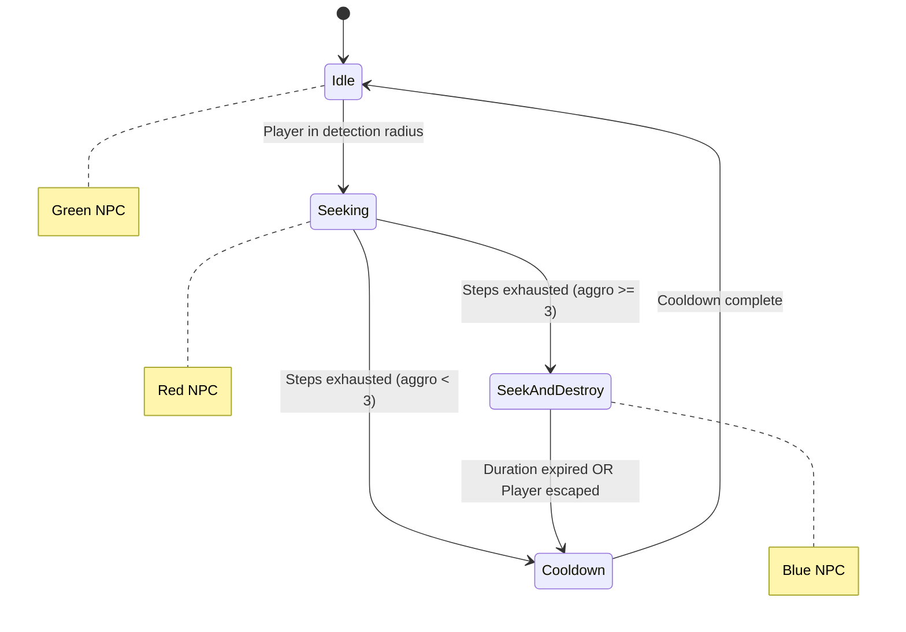
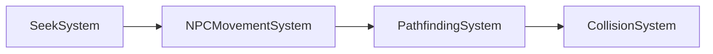
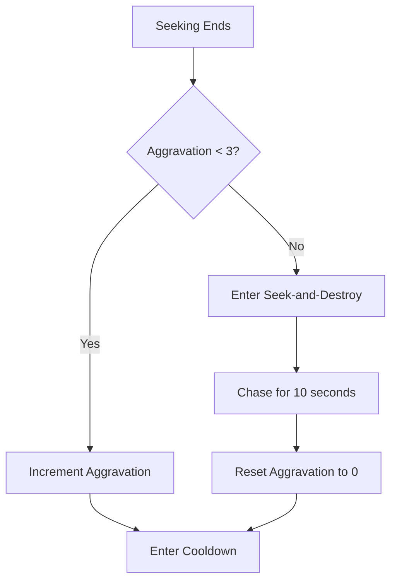
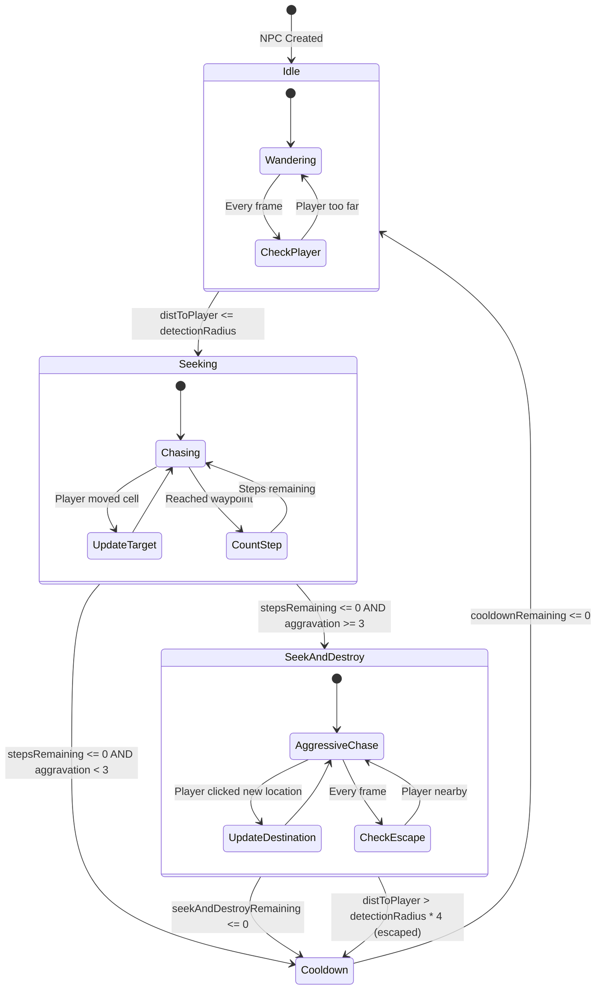

# NPC Seek Behavior System

A complete guide to the NPC pursuit mechanics including seeking, aggravation, and seek-and-destroy modes. This system creates dynamic enemy behavior where NPCs detect, chase, and become increasingly aggressive toward players.

> **Multiplayer Note:** NPCs are friendly to their owner and only attack other players. See [Multiplayer System](./multiplayer-implementation-plan.md) for details.

---

## Table of Contents

1. [Overview](#overview)
2. [Behavior States](#behavior-states)
3. [Components](#components)
4. [SeekSystem](#seeksystem)
5. [Aggravation Mechanics](#aggravation-mechanics)
6. [Seek-and-Destroy Mode](#seek-and-destroy-mode)
7. [Visual Feedback](#visual-feedback)
8. [Integration with Other Systems](#integration-with-other-systems)
9. [Multiplayer Targeting](#multiplayer-targeting)
10. [Configuration](#configuration)
11. [State Machine Diagram](#state-machine-diagram)

> **Related Documentation:** See [NPC Spawner System](./npc-spawner-system.md) for NPC creation and [Pathfinding System](./pathfinding-system.md) for movement mechanics.

---

## Overview

The Seek Behavior System gives NPCs the ability to detect and pursue the player. NPCs transition through multiple states based on proximity and accumulated aggravation.

**Key Features:**
- **Detection radius**: NPCs detect player within configurable range (default: 4 cells)
- **Step-based pursuit**: Normal seeking lasts for N steps (default: 5 cells traveled)
- **Aggravation system**: Repeated encounters increase aggression
- **Seek-and-destroy mode**: Triggered after 3 encounters, time-based (10 seconds)
- **Smart targeting**: Seek-and-destroy chases player's destination, not current position
- **Visual feedback**: Color changes indicate NPC state (green/red/blue)



---

## Behavior States

| State | Color | Trigger | Behavior | Exit Condition |
|-------|-------|---------|----------|----------------|
| **Idle** | Green | Default state | Wander randomly | Player enters detection radius |
| **Seeking** | Red | Player detected | Chase player's current position | 5 cells traveled |
| **Cooldown** | Green | Seeking ends | Pause before returning to idle | Timer expires (3 seconds) |
| **Seek-and-Destroy** | Blue | Aggravation reaches 3 | Chase player's click destination | 10 seconds OR player escapes |

---

## Components

### SeekBehavior Component

Located in `src/ecs/components/seek.ts`:

```typescript
export interface SeekBehavior {
  state: SeekState;              // "idle" | "seeking" | "cooldown" | "seek-and-destroy"
  detectionRadius: number;       // Detection range in cells (default: 4)
  pursuitSteps: number;          // Steps per pursuit (default: 5)
  stepsRemaining: number;        // Current pursuit progress
  cooldownTime: number;          // Cooldown duration in seconds (default: 3)
  cooldownRemaining: number;     // Current cooldown progress
  lastPlayerCellX: number;       // Last known player cell X
  lastPlayerCellZ: number;       // Last known player cell Z

  // Aggravation
  aggravationCount: number;      // Times player triggered seeking
  aggravationThreshold: number;  // Triggers seek-and-destroy (default: 3)
  seekAndDestroyDuration: number; // Duration in seconds (default: 10)
  seekAndDestroyRemaining: number; // Time remaining
}
```

---

## SeekSystem

Located in `src/systems/SeekSystem.ts`, runs **before** NPCMovementSystem.

### Processing Order



### Core Logic

1. **Get player position** and convert to cell coordinates
2. **Query all entities** with SeekBehavior, PathFollower, and Position
3. **Calculate distance** to player for each NPC
4. **Process state machine** for each NPC

---

## Aggravation Mechanics

Aggravation tracks how many times an NPC has chased the player.

### Aggravation Flow



### Rules

- **Increments**: When a seeking pursuit completes (steps exhausted)
- **Threshold**: 3 encounters triggers seek-and-destroy
- **Resets**: Only after seek-and-destroy ends (by time or escape)
- **Persists**: Aggravation survives cooldown periods

---

## Seek-and-Destroy Mode

The most aggressive pursuit mode, triggered when aggravation reaches threshold.

### Key Differences from Normal Seeking

| Aspect | Normal Seeking | Seek-and-Destroy |
|--------|---------------|------------------|
| **Duration** | 5 cells traveled | 10 seconds |
| **Target** | Player's current position | Player's click destination |
| **Color** | Red | Blue |
| **Escape** | N/A | Get 16+ cells away |

### Smart Targeting

Seek-and-destroy targets where the player is **going**, not where they are:

```typescript
// Get player's PathFollower component
const playerPf = world.getComponent<PathFollower>(PLAYER_ENTITY, PATH_FOLLOWER);
if (playerPf) {
  // Target player's destination (where they clicked)
  pf.targetX = playerPf.targetX;
  pf.targetZ = playerPf.targetZ;
}
```

This makes the NPC anticipate player movement, creating more challenging gameplay.

### Escape Mechanic

Players can escape seek-and-destroy by getting far enough away:
- **Escape distance**: 4x detection radius (default: 16 cells)
- **Effect**: Ends seek-and-destroy, resets aggravation to 0
- **NPC returns**: To cooldown, then idle

---

## Visual Feedback

NPCs change color to indicate their state. Uses shared materials for performance.

### Materials

Defined in `src/structures/BlockTypes.ts`:

```typescript
export const NPC_MATERIAL = new THREE.MeshStandardMaterial({ color: 0x00ff00 });        // Green - Idle
export const NPC_MATERIAL_SEEKING = new THREE.MeshStandardMaterial({ color: 0xff0000 }); // Red - Seeking
export const NPC_MATERIAL_AGGRO = new THREE.MeshStandardMaterial({ color: 0x0066ff });   // Blue - Seek-and-Destroy
```

### Color Changes

| Transition | Color Change |
|------------|--------------|
| Idle → Seeking | Green → Red |
| Seeking → Cooldown | Red → Green |
| Seeking → Seek-and-Destroy | Red → Blue |
| Seek-and-Destroy → Cooldown | Blue → Green |

---

## Integration with Other Systems

### NPCMovementSystem

Skips wandering logic when NPC is seeking or in seek-and-destroy:

```typescript
if (seek && (seek.state === "seeking" || seek.state === "seek-and-destroy")) {
  continue; // SeekSystem handles movement
}
```

### PathfindingSystem

Seeking/aggro NPCs don't avoid the player as an obstacle:

```typescript
const isChasing = seek?.state === "seeking" || seek?.state === "seek-and-destroy";
const dynamicObstacles = (isNPC && !isChasing) ? playerObstacles : undefined;
```

### CollisionResponseSystem

Seeking/aggro NPCs don't clear their path on player collision:

```typescript
const isSeeking = seek?.state === "seeking" || seek?.state === "seek-and-destroy";
if (playerContact && isSeeking) {
  // Just stop movement, don't clear path
}
```

---

## Multiplayer Targeting

In multiplayer, NPCs use ownership to determine who to attack.

### Ownership

Every NPC has an `ownerId` field inherited from its spawner:

```typescript
interface NPCData {
  spawnerEntityId: number;
  facingAngle: number;
  ownerId: string;  // Player ID who owns this NPC
}
```

### Target Selection

The SeekSystem finds the nearest **enemy** player:

```typescript
function findNearestEnemy(world, npcPos, npcOwnerId, detectionRadius) {
  const players = world.query(PLAYER_IDENTITY, POSITION);

  for (const playerEntityId of players) {
    const identity = world.getComponent(playerEntityId, PLAYER_IDENTITY);

    // Skip if this is the NPC's owner (friendly)
    if (identity.playerId === npcOwnerId) continue;

    // Check distance and track nearest enemy
    // ...
  }
}
```

### Targeting Rules

| NPC Owner | Target Player | Behavior |
|-----------|---------------|----------|
| Player A | Player A | **Ignore** (friendly) |
| Player A | Player B | **Attack** (enemy) |
| Player A | Player C | **Attack** (enemy) |

### Single-Player Fallback

When no `PlayerIdentity` components exist (single-player mode), the system falls back to targeting `PLAYER_ENTITY`:

```typescript
if (playersWithIdentity.length === 0) {
  // Single-player mode - target PLAYER_ENTITY
  const playerPos = world.getComponent(PLAYER_ENTITY, POSITION);
  // ...
}
```

---

## Configuration

Default values in `src/entities/createNPC.ts`:

```typescript
const NPC_DEFAULTS = {
  seek: {
    detectionRadius: 4,          // Cells
    pursuitSteps: 5,             // Steps before cooldown
    cooldownTime: 3,             // Seconds
    aggravationThreshold: 3,     // Seeks before seek-and-destroy
    seekAndDestroyDuration: 10,  // Seconds
  },
};
```

### Tuning Guide

| Parameter | Effect of Increasing | Effect of Decreasing |
|-----------|---------------------|---------------------|
| `detectionRadius` | NPCs detect from farther | Player can get closer safely |
| `pursuitSteps` | Longer chases | Shorter chases |
| `cooldownTime` | More time between chases | More frequent chases |
| `aggravationThreshold` | Harder to trigger seek-and-destroy | Easier to trigger |
| `seekAndDestroyDuration` | Longer aggressive phase | Shorter aggressive phase |

---

## State Machine Diagram

Complete state machine with all transitions:


