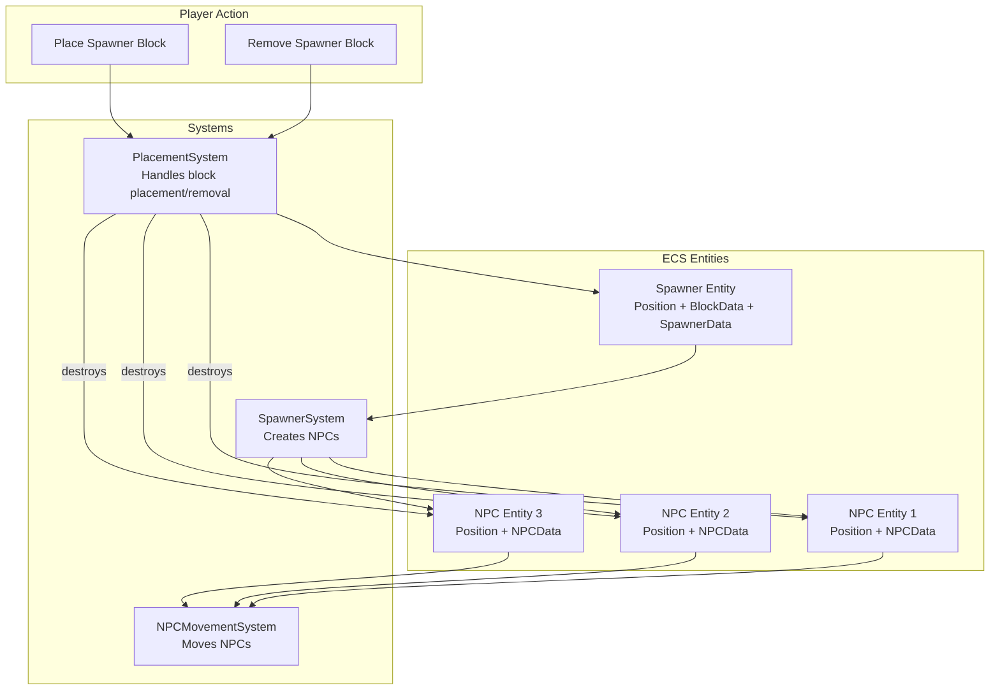
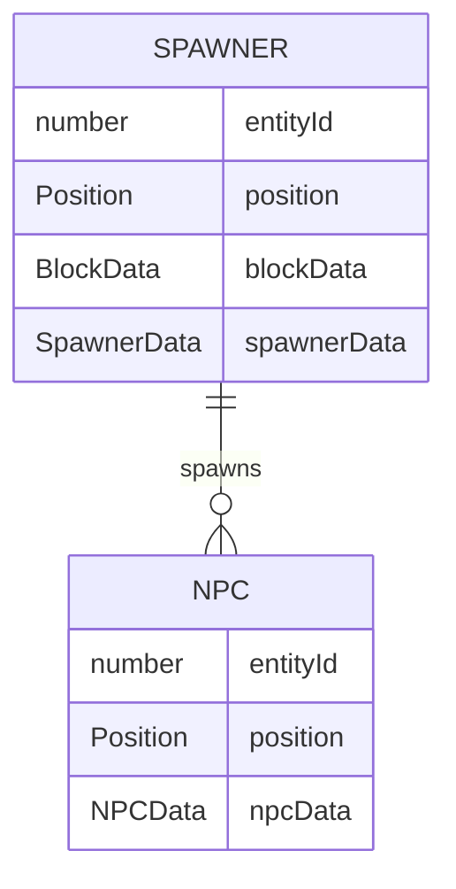
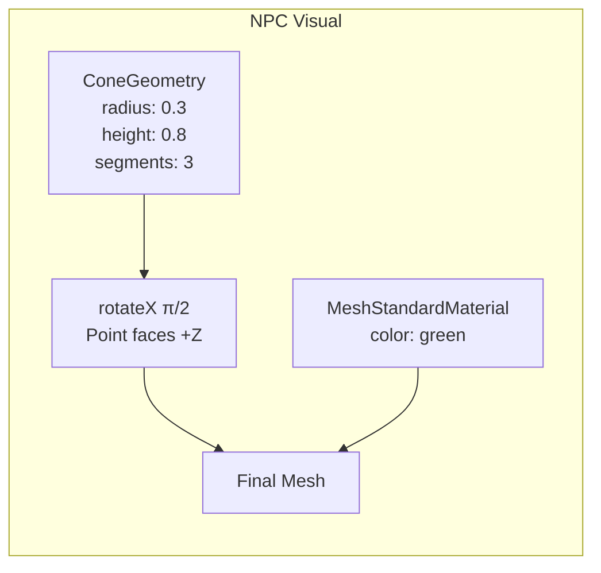
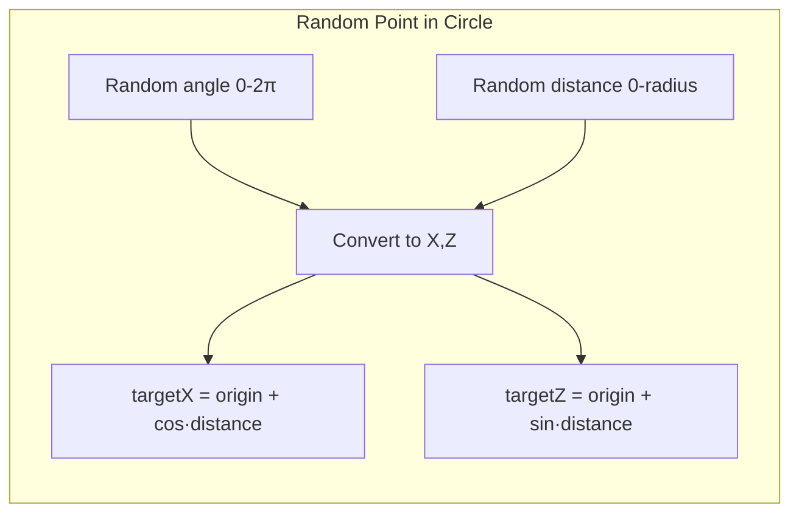
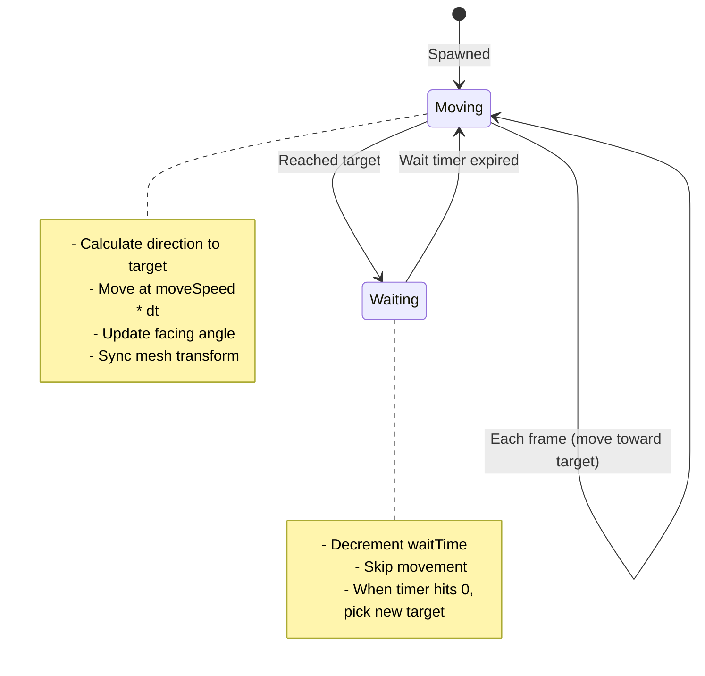
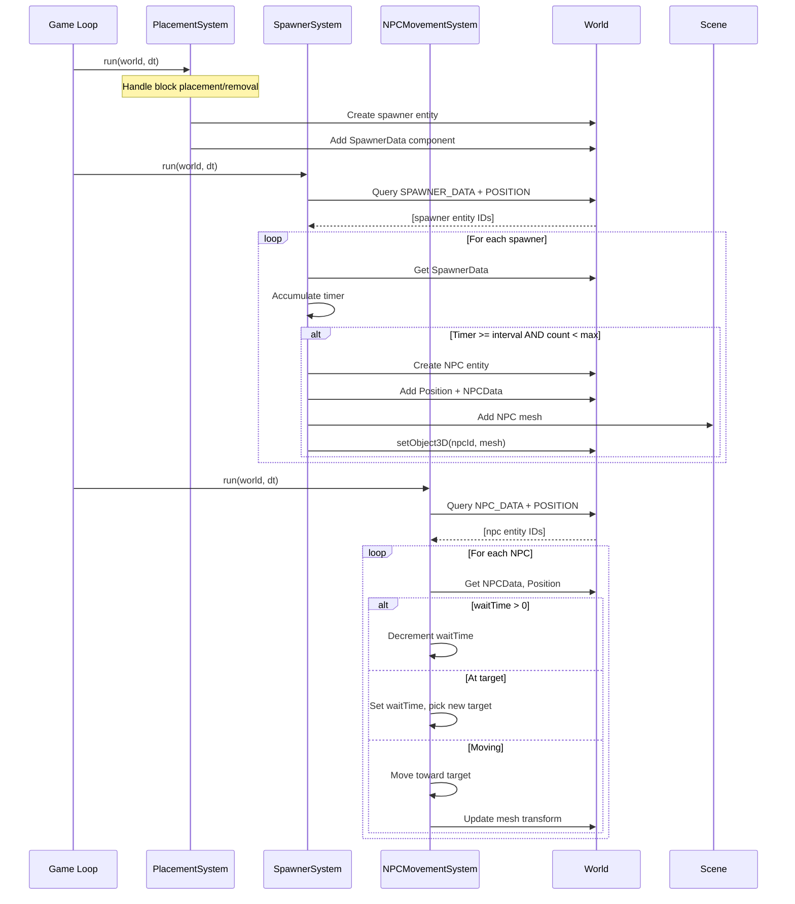

# NPC Spawner System

A complete guide to implementing spawner blocks that create wandering NPCs. This system demonstrates advanced ECS patterns including entity relationships, component-based configuration, and multi-system coordination.

---

## Table of Contents

1. [Overview](#overview)
2. [Architecture](#architecture)
3. [Components](#components)
4. [Block Type Registration](#block-type-registration)
5. [SpawnerSystem](#spawnersystem)
6. [NPCMovementSystem](#npcmovementsystem)
7. [PlacementSystem Integration](#placementsystem-integration)
8. [Data Flow](#data-flow)
9. [Implementing in Your Codebase](#implementing-in-your-codebase)
10. [Customization Guide](#customization-guide)

---

## Overview

The NPC Spawner System allows players to place special "spawner" blocks that automatically create NPC entities. These NPCs wander randomly within a configurable radius around their spawner.

**Key Features:**
- Spawner blocks create NPCs at regular intervals
- NPCs wander randomly within a radius of their origin
- NPCs are visualized as 3D triangles pointing in their movement direction
- Removing a spawner automatically despawns all its NPCs
- Fully configurable: radius, max NPCs, spawn interval, movement speed



---

## Architecture

The spawner system follows ECS principles with clear separation of concerns:

| Layer | Responsibility | Files |
|-------|---------------|-------|
| **Components** | Define data structures for spawners and NPCs | `src/ecs/components.ts` |
| **Block Types** | Register spawner as a placeable block + NPC visuals | `src/structures/BlockTypes.ts` |
| **SpawnerSystem** | Spawn NPCs when conditions are met | `src/systems/SpawnerSystem.ts` |
| **NPCMovementSystem** | Move NPCs toward targets, pick new targets | `src/systems/NPCMovementSystem.ts` |
| **PlacementSystem** | Create spawner components, cleanup on removal | `src/systems/PlacementSystem.ts` |

### Entity Relationships



The spawner tracks its NPCs via `spawnedNPCIds: Set<number>`, and each NPC knows its parent via `spawnerEntityId: number`.

---

## Components

Components are pure data — no methods, no logic. Define them in your components file.

### SpawnerData Component

```typescript
// src/ecs/components.ts

// Component name constant (used for registration and queries)
export const SPAWNER_DATA = "SpawnerData";

// Component data interface
export interface SpawnerData {
  radius: number;              // Wander radius (default: 5)
  maxNPCs: number;             // Maximum NPCs to spawn (default: 3)
  spawnedNPCIds: Set<number>;  // Track spawned NPC entity IDs
  spawnInterval: number;       // Seconds between spawns (default: 2)
  timeSinceLastSpawn: number;  // Accumulator for spawn timing
}
```

**Field Breakdown:**

| Field | Type | Purpose |
|-------|------|---------|
| `radius` | `number` | How far NPCs can wander from the spawner |
| `maxNPCs` | `number` | Spawn limit — stops spawning when reached |
| `spawnedNPCIds` | `Set<number>` | Tracks which NPC entities belong to this spawner |
| `spawnInterval` | `number` | Cooldown between spawns in seconds |
| `timeSinceLastSpawn` | `number` | Timer that accumulates delta time |

### NPCData Component

```typescript
// src/ecs/components.ts

export const NPC_DATA = "NPCData";

export interface NPCData {
  spawnerEntityId: number;  // Parent spawner entity
  originX: number;          // Spawner X position (center of wander area)
  originZ: number;          // Spawner Z position
  radius: number;           // Wander radius (copied from spawner)
  targetX: number;          // Current movement target X
  targetZ: number;          // Current movement target Z
  moveSpeed: number;        // Units per second (default: 2)
  facingAngle: number;      // Y-axis rotation for mesh
  waitTime: number;         // Pause timer at target (0 = moving)
}
```

**Field Breakdown:**

| Field | Type | Purpose |
|-------|------|---------|
| `spawnerEntityId` | `number` | Links NPC back to its spawner |
| `originX`, `originZ` | `number` | Center point for wander calculations |
| `radius` | `number` | Maximum distance from origin |
| `targetX`, `targetZ` | `number` | Current destination coordinates |
| `moveSpeed` | `number` | Movement speed in units/second |
| `facingAngle` | `number` | Rotation angle (radians) for visual orientation |
| `waitTime` | `number` | Countdown timer for pausing at destinations |

### Adding to ComponentTypeMap

For TypeScript type safety, add your components to the type map:

```typescript
export interface ComponentTypeMap {
  // ... existing components ...
  [SPAWNER_DATA]: SpawnerData;
  [NPC_DATA]: NPCData;
}
```

---

## Block Type Registration

Register the spawner as a placeable block type and define NPC visuals.

### Spawner Block

```typescript
// src/structures/BlockTypes.ts

export const BLOCK_TYPES: BlockType[] = [
  // ... existing blocks (stone, grass, dirt, wood, gold) ...
  {
    id: "spawner",
    name: "Spawner",
    color: 0xff00ff,    // Magenta
    metalness: 0.8,
    roughness: 0.2
  },
];
```

The spawner appears as a shiny magenta cube. Players select it by pressing `6` (the 6th block type).

### NPC Geometry and Material

NPCs use a cone/triangle shape that points in their movement direction:

```typescript
// src/structures/BlockTypes.ts

import * as THREE from "three";

// NPC geometry - a cone with 3 sides creates a triangle shape
export const NPC_GEOMETRY = (() => {
  const geometry = new THREE.ConeGeometry(0.3, 0.8, 3);
  // Rotate so the point faces +Z (forward direction)
  geometry.rotateX(Math.PI / 2);
  return geometry;
})();

// Bright green material for visibility
export const NPC_MATERIAL = new THREE.MeshStandardMaterial({
  color: 0x00ff00
});
```

**Why an IIFE for geometry?**

The geometry is created once at module load time. Using an IIFE (Immediately Invoked Function Expression) lets us apply the rotation during creation rather than every time we create an NPC mesh.



---

## SpawnerSystem

The SpawnerSystem runs every frame, checking each spawner to see if it should create a new NPC.

### Full Implementation

```typescript
// src/systems/SpawnerSystem.ts

import * as THREE from "three";
import { World } from "../ecs/World";
import {
  SPAWNER_DATA,
  NPC_DATA,
  POSITION,
  type SpawnerData,
  type NPCData,
  type Position,
} from "../ecs/components";
import { NPC_GEOMETRY, NPC_MATERIAL } from "../structures/BlockTypes";

export function createSpawnerSystem(
  scene: THREE.Scene
): (world: World, dt: number) => void {
  return (world: World, dt: number) => {
    // Query all entities that have both SPAWNER_DATA and POSITION
    const spawners = world.query(SPAWNER_DATA, POSITION);

    for (const spawnerId of spawners) {
      const spawner = world.getComponent<SpawnerData>(spawnerId, SPAWNER_DATA);
      const pos = world.getComponent<Position>(spawnerId, POSITION);
      if (!spawner || !pos) continue;

      // Clean up dead NPCs from tracking set
      for (const npcId of spawner.spawnedNPCIds) {
        if (!world.isAlive(npcId)) {
          spawner.spawnedNPCIds.delete(npcId);
        }
      }

      // Accumulate spawn timer
      spawner.timeSinceLastSpawn += dt;

      // Check spawn conditions
      if (
        spawner.timeSinceLastSpawn >= spawner.spawnInterval &&
        spawner.spawnedNPCIds.size < spawner.maxNPCs
      ) {
        spawner.timeSinceLastSpawn = 0;

        // Pick random position within radius for initial target
        const angle = Math.random() * Math.PI * 2;
        const distance = Math.random() * spawner.radius;
        const targetX = pos.x + Math.cos(angle) * distance;
        const targetZ = pos.z + Math.sin(angle) * distance;

        // Create NPC entity
        const npcEntity = world.createEntity();
        world.addComponent<Position>(npcEntity, POSITION, {
          x: pos.x,
          y: pos.y,
          z: pos.z,
        });
        world.addComponent<NPCData>(npcEntity, NPC_DATA, {
          spawnerEntityId: spawnerId,
          originX: pos.x,
          originZ: pos.z,
          radius: spawner.radius,
          targetX,
          targetZ,
          moveSpeed: 2,
          facingAngle: Math.atan2(targetX - pos.x, targetZ - pos.z),
          waitTime: 0,
        });

        // Create and configure mesh
        const mesh = new THREE.Mesh(NPC_GEOMETRY, NPC_MATERIAL);
        mesh.position.set(pos.x, pos.y + 0.4, pos.z);
        mesh.rotation.y = Math.atan2(targetX - pos.x, targetZ - pos.z);
        scene.add(mesh);
        world.setObject3D(npcEntity, mesh);

        // Track NPC in spawner
        spawner.spawnedNPCIds.add(npcEntity);
      }
    }
  };
}
```

### Key Concepts Explained

#### 1. System Factory Pattern

```typescript
export function createSpawnerSystem(scene: THREE.Scene): (world: World, dt: number) => void
```

Systems are created via factory functions that capture dependencies (like `scene`) in a closure. This lets the system access the scene without it being passed every frame.

#### 2. Component Queries

```typescript
const spawners = world.query(SPAWNER_DATA, POSITION);
```

The `query()` method returns all entity IDs that have ALL the specified components. This is how systems find the entities they care about.

#### 3. Dead Entity Cleanup

```typescript
for (const npcId of spawner.spawnedNPCIds) {
  if (!world.isAlive(npcId)) {
    spawner.spawnedNPCIds.delete(npcId);
  }
}
```

NPCs might be destroyed externally. This cleanup ensures the spawner's tracking set stays accurate.

#### 4. Timer Accumulation

```typescript
spawner.timeSinceLastSpawn += dt;
if (spawner.timeSinceLastSpawn >= spawner.spawnInterval) {
  spawner.timeSinceLastSpawn = 0;
  // spawn...
}
```

This is the standard pattern for time-based events in game loops. Accumulate delta time until a threshold is reached.

#### 5. Random Position in Circle

```typescript
const angle = Math.random() * Math.PI * 2;
const distance = Math.random() * spawner.radius;
const targetX = pos.x + Math.cos(angle) * distance;
const targetZ = pos.z + Math.sin(angle) * distance;
```

Generates a random point within a circle using polar coordinates:



---

## NPCMovementSystem

The NPCMovementSystem handles NPC behavior: moving toward targets, pausing at destinations, and picking new targets.

### Full Implementation

```typescript
// src/systems/NPCMovementSystem.ts

import { World } from "../ecs/World";
import {
  NPC_DATA,
  POSITION,
  type NPCData,
  type Position,
} from "../ecs/components";

export function createNPCMovementSystem(): (world: World, dt: number) => void {
  return (world: World, dt: number) => {
    const npcs = world.query(NPC_DATA, POSITION);

    for (const npcId of npcs) {
      const npc = world.getComponent<NPCData>(npcId, NPC_DATA);
      const pos = world.getComponent<Position>(npcId, POSITION);
      if (!npc || !pos) continue;

      // If waiting, decrement wait time and skip movement
      if (npc.waitTime > 0) {
        npc.waitTime -= dt;
        continue;
      }

      // Calculate distance to target
      const dx = npc.targetX - pos.x;
      const dz = npc.targetZ - pos.z;
      const distance = Math.sqrt(dx * dx + dz * dz);

      // Check if at target
      if (distance < 0.1) {
        // Set random wait time (0.5 to 1.5 seconds)
        npc.waitTime = 0.5 + Math.random();

        // Pick new random target within radius of origin
        const angle = Math.random() * Math.PI * 2;
        const targetDistance = Math.random() * npc.radius;
        npc.targetX = npc.originX + Math.cos(angle) * targetDistance;
        npc.targetZ = npc.originZ + Math.sin(angle) * targetDistance;
        continue;
      }

      // Move toward target
      const moveAmount = npc.moveSpeed * dt;
      const ratio = Math.min(moveAmount / distance, 1);
      pos.x += dx * ratio;
      pos.z += dz * ratio;

      // Update facing angle based on movement direction
      npc.facingAngle = Math.atan2(dx, dz);

      // Sync mesh position and rotation
      const mesh = world.getObject3D(npcId);
      if (mesh) {
        mesh.position.set(pos.x, pos.y + 0.4, pos.z);
        mesh.rotation.y = npc.facingAngle;
      }
    }
  };
}
```

### NPC State Machine

The NPC behavior is a simple state machine:



### Movement Math Explained

```typescript
// Vector from current position to target
const dx = npc.targetX - pos.x;
const dz = npc.targetZ - pos.z;
const distance = Math.sqrt(dx * dx + dz * dz);

// How far we can move this frame
const moveAmount = npc.moveSpeed * dt;

// Ratio ensures we don't overshoot the target
const ratio = Math.min(moveAmount / distance, 1);

// Apply movement
pos.x += dx * ratio;
pos.z += dz * ratio;
```

**Why use a ratio?**

If the NPC is 0.05 units from the target but `moveAmount` is 0.1, moving the full amount would overshoot. The `Math.min(moveAmount / distance, 1)` ensures we never move more than the remaining distance.

### Facing Angle Calculation

```typescript
npc.facingAngle = Math.atan2(dx, dz);
mesh.rotation.y = npc.facingAngle;
```

`atan2(dx, dz)` gives the angle in radians from the +Z axis toward +X. Since our cone geometry points toward +Z after rotation, setting `rotation.y` makes it face the movement direction.

```mermaid
graph TB
    subgraph "Angle Calculation"
        DX[dx = target.x - pos.x]
        DZ[dz = target.z - pos.z]
        ATAN[atan2(dx, dz)]
        ANGLE[facingAngle in radians]
    end
    DX --> ATAN
    DZ --> ATAN
    ATAN --> ANGLE
```

---

## PlacementSystem Integration

The existing PlacementSystem needs modifications to handle spawner blocks.

### Creating a Spawner

When a spawner block is placed, add the SpawnerData component:

```typescript
// In placeBlock() function

// Create block entity (existing code)
const blockEntity = world.createEntity();
world.addComponent<Position>(blockEntity, POSITION, { x: newX, y: newY, z: newZ });
world.addComponent<BlockData>(blockEntity, BLOCK_DATA, { blockType: gs.selectedBlockType });
world.setObject3D(blockEntity, mesh);

// NEW: Add spawner component if this is a spawner block
if (gs.selectedBlockType === "spawner") {
  world.addComponent<SpawnerData>(blockEntity, SPAWNER_DATA, {
    radius: 5,
    maxNPCs: 3,
    spawnedNPCIds: new Set(),
    spawnInterval: 2,
    timeSinceLastSpawn: 0,
  });
}

gs.placedBlockKeys.set(key, blockEntity);
```

### Destroying a Spawner

When a spawner is removed, destroy all its NPCs first:

```typescript
// In removeBlock() function

const blockEntity = gs.placedBlockKeys.get(key);
if (blockEntity === undefined) return;

// NEW: If this is a spawner, destroy all its NPCs first
const spawnerData = world.getComponent<SpawnerData>(blockEntity, SPAWNER_DATA);
if (spawnerData) {
  for (const npcId of spawnerData.spawnedNPCIds) {
    const npcMesh = world.getObject3D(npcId);
    if (npcMesh) scene.remove(npcMesh);
    world.destroyEntity(npcId);
  }
  spawnerData.spawnedNPCIds.clear();
}

// Continue with normal block removal...
const mesh = world.getObject3D(blockEntity);
if (mesh) scene.remove(mesh);
world.destroyEntity(blockEntity);
```

### Why Cleanup in PlacementSystem?

The PlacementSystem already handles block removal, so it's the natural place to add spawner cleanup logic. This keeps related logic together and ensures NPCs are cleaned up immediately when their spawner is removed.

---

## Data Flow

Here's how data flows through the system each frame:



---

## Implementing in Your Codebase

Follow these steps to add the spawner system to your own ECS-based Three.js project.

### Step 1: Define Components

Add to your components file:

```typescript
// Constants
export const SPAWNER_DATA = "SpawnerData";
export const NPC_DATA = "NPCData";

// Interfaces
export interface SpawnerData {
  radius: number;
  maxNPCs: number;
  spawnedNPCIds: Set<number>;
  spawnInterval: number;
  timeSinceLastSpawn: number;
}

export interface NPCData {
  spawnerEntityId: number;
  originX: number;
  originZ: number;
  radius: number;
  targetX: number;
  targetZ: number;
  moveSpeed: number;
  facingAngle: number;
  waitTime: number;
}
```

### Step 2: Add Block Type and Visuals

```typescript
// Block type
{ id: "spawner", name: "Spawner", color: 0xff00ff, metalness: 0.8, roughness: 0.2 }

// NPC visuals
export const NPC_GEOMETRY = (() => {
  const geometry = new THREE.ConeGeometry(0.3, 0.8, 3);
  geometry.rotateX(Math.PI / 2);
  return geometry;
})();
export const NPC_MATERIAL = new THREE.MeshStandardMaterial({ color: 0x00ff00 });
```

### Step 3: Create Systems

Create `SpawnerSystem.ts` and `NPCMovementSystem.ts` (see full implementations above).

### Step 4: Register Systems

Add to your system pipeline:

```typescript
const systems = [
  createInputSystem(),
  createCameraMovementSystem(),
  // ... other systems ...
  createPlacementSystem(scene),
  createSpawnerSystem(scene),      // After PlacementSystem
  createNPCMovementSystem(),       // After SpawnerSystem
  createRenderSyncSystem(),
];
```

**Order matters!** SpawnerSystem must run after PlacementSystem so newly placed spawners have their components. NPCMovementSystem must run after SpawnerSystem so newly spawned NPCs can move on their first frame.

### Step 5: Integrate with Placement

Modify your placement system to:
1. Add SpawnerData when placing spawner blocks
2. Clean up NPCs when removing spawner blocks

---

## Customization Guide

### Adjusting Defaults

Modify these values when creating SpawnerData:

```typescript
world.addComponent<SpawnerData>(blockEntity, SPAWNER_DATA, {
  radius: 10,          // Larger wander area
  maxNPCs: 5,          // More NPCs per spawner
  spawnedNPCIds: new Set(),
  spawnInterval: 1,    // Faster spawning
  timeSinceLastSpawn: 0,
});
```

### Different NPC Speeds

Modify when creating NPCData in SpawnerSystem:

```typescript
world.addComponent<NPCData>(npcEntity, NPC_DATA, {
  // ...
  moveSpeed: 4,  // Faster NPCs
  // ...
});
```

### Custom NPC Appearance

Replace the geometry and material:

```typescript
// Different shape
export const NPC_GEOMETRY = new THREE.SphereGeometry(0.4, 8, 8);

// Different color
export const NPC_MATERIAL = new THREE.MeshStandardMaterial({
  color: 0xff6600,  // Orange
  emissive: 0x331100,
});
```

### Adding NPC Types

Extend NPCData with a type field:

```typescript
export interface NPCData {
  // ... existing fields ...
  npcType: "wanderer" | "guard" | "merchant";
}
```

Then branch behavior in NPCMovementSystem:

```typescript
if (npc.npcType === "guard") {
  // Stand still, face random direction occasionally
} else if (npc.npcType === "merchant") {
  // Follow a fixed path
} else {
  // Default wander behavior
}
```

### Per-Spawner Configuration

To allow different spawners to have different settings, you could:

1. Add a spawner type to BlockData
2. Look up configuration based on type
3. Or: create a UI to configure spawners after placement

---

## File Map

| File | Purpose |
|------|---------|
| `src/ecs/components.ts` | SPAWNER_DATA, NPC_DATA constants and interfaces |
| `src/structures/BlockTypes.ts` | Spawner block type, NPC_GEOMETRY, NPC_MATERIAL |
| `src/systems/SpawnerSystem.ts` | Spawn NPCs from spawner blocks |
| `src/systems/NPCMovementSystem.ts` | NPC wandering behavior |
| `src/systems/PlacementSystem.ts` | Spawner creation and cleanup integration |
| `src/main.ts` | System registration |

---

## Summary

The NPC Spawner System demonstrates several important ECS patterns:

1. **Entity Relationships**: Spawners track their NPCs, NPCs know their spawner
2. **Component-Based Configuration**: All settings live in component data
3. **Multi-System Coordination**: SpawnerSystem creates, NPCMovementSystem animates, PlacementSystem cleans up
4. **Factory Pattern for Systems**: Capture dependencies like `scene` in closures
5. **Timer Accumulation**: Standard pattern for time-based game events
6. **Cleanup Responsibilities**: Systems that create entities should have cleanup paths

This pattern can be extended to any spawner-type system: enemy spawners, particle emitters, resource generators, etc.
