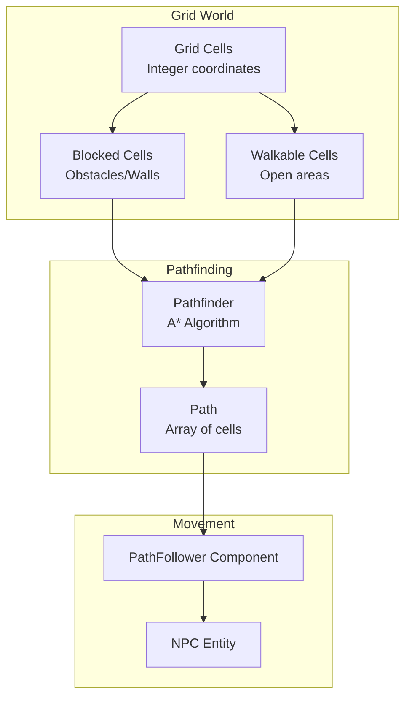
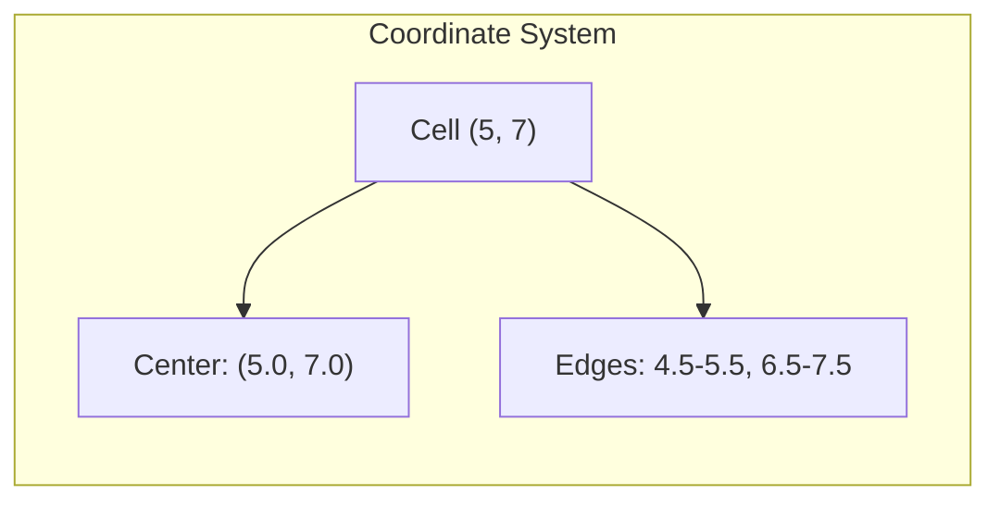
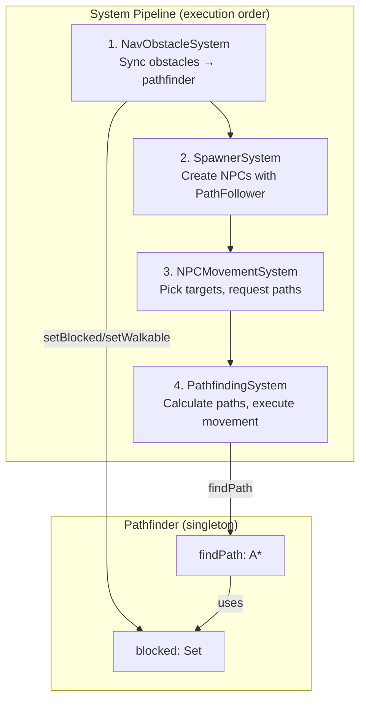
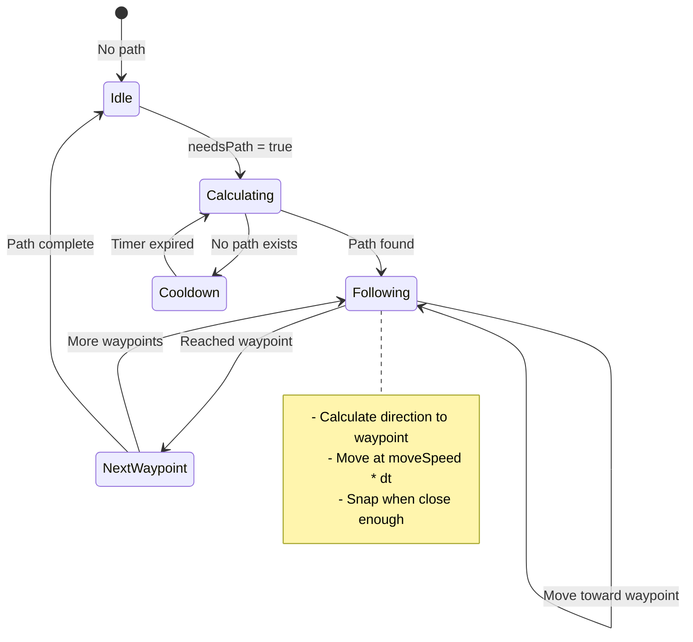
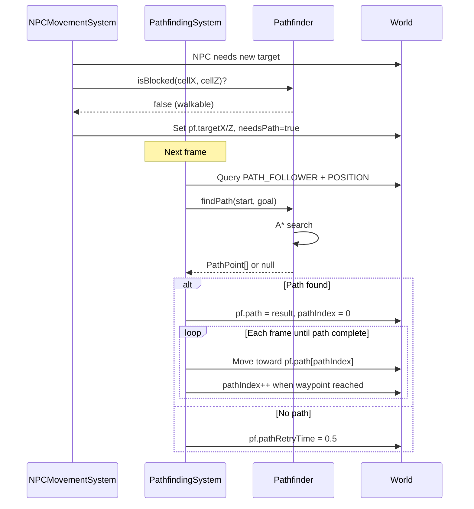
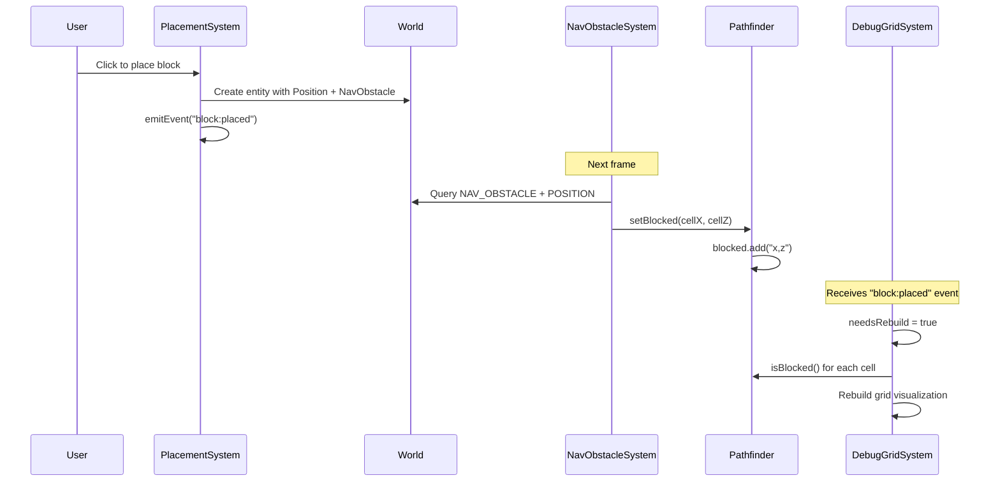

# Grid-Based Pathfinding System

A complete A* pathfinding implementation for grid-based movement. NPCs navigate around obstacles, walking through cell centers while respecting blocked areas.

---

## Table of Contents

1. [Overview](#overview)
2. [Coordinate System](#coordinate-system)
3. [Core Components](#core-components)
4. [Pathfinder Class](#pathfinder-class)
5. [Systems Overview](#systems-overview)
6. [NavObstacleSystem](#navobstaclesystem)
7. [PathfindingSystem](#pathfindingsystem)
8. [NPCMovementSystem Integration](#npcmovementsystem-integration)
9. [Debug Visualization](#debug-visualization)
10. [Data Flow](#data-flow)
11. [Algorithm Details](#algorithm-details)
12. [Extending the System](#extending-the-system)

---

## Overview

The pathfinding system enables NPCs to navigate around obstacles using the A* algorithm on a 2D grid. This is the same approach used in classic grid-based games like Snake, RTS games, and point-and-click adventures.

**Key Features:**
- A* algorithm with Manhattan distance heuristic
- 4-directional movement (no diagonals for cleaner grid alignment)
- Dynamic obstacle registration (blocks can be added/removed at runtime)
- Separation of concerns: pathfinding calculates routes, movement systems execute them
- Works identically for AI-controlled NPCs and potential player click-to-move



---

## Coordinate System

**This is critical to understand.** The entire system uses a consistent coordinate scheme:

### Cell Coordinates (Integers)
- Cells are identified by integer pairs: `(5, 7)`, `(0, 0)`, `(-3, 12)`
- Cell `(5, 7)` represents the area from world `(4.5, 6.5)` to `(5.5, 7.5)`
- The **center** of cell `(5, 7)` is at world position `(5, 7)`

### World Coordinates (Can be floats)
- Actual positions in 3D space
- Entities move through world coordinates
- Cell centers are at integer world positions

### Conversion Functions

```typescript
// Convert world position to cell (round to nearest integer)
static worldToCell(worldX: number, worldZ: number): { x: number; z: number } {
  return { x: Math.round(worldX), z: Math.round(worldZ) };
}

// Convert cell to world position (cell center = integer)
static cellToWorld(cellX: number, cellZ: number): { x: number; z: number } {
  return { x: cellX, z: cellZ };
}
```

### Visual Alignment

Everything aligns because cell centers are at integers:

```
World X:    4.5    5.0    5.5    6.0    6.5
             |      |      |      |      |
             +------+------+------+------+
             |      |      |      |      |
Cell:        |  (5,7)  |  (6,7)  |
             |   ●     |         |     ● = cell center at (5, 7)
             +------+------+------+
             |      |      |      |
```



---

## Core Components

### PathFollower Component

Entities that can follow paths need this component:

```typescript
// src/ecs/components.ts

export const PATH_FOLLOWER = "PathFollower";

export interface PathFollower {
  path: PathPoint[];      // Array of cell coordinates to follow
  pathIndex: number;      // Current waypoint index (-1 = no path)
  targetX: number;        // Final destination (world coords)
  targetZ: number;
  moveSpeed: number;      // Units per second
  needsPath: boolean;     // Flag to request new path calculation
  pathRetryTime: number;  // Cooldown before retrying failed path
}
```

| Field | Purpose |
|-------|---------|
| `path` | Sequence of cell coordinates from A* |
| `pathIndex` | Which waypoint we're moving toward |
| `targetX/Z` | Ultimate destination (triggers path calculation) |
| `moveSpeed` | How fast the entity moves |
| `needsPath` | Set `true` to request path recalculation |
| `pathRetryTime` | Prevents spam when no path exists |

### NavObstacle Component

Marks an entity as blocking pathfinding:

```typescript
export const NAV_OBSTACLE = "NavObstacle";

export interface NavObstacle {
  // Empty - presence alone marks entity as obstacle
}
```

Any entity with `Position + NavObstacle` blocks the cell it occupies.

### PathPoint Interface

```typescript
// src/core/Pathfinder.ts

export interface PathPoint {
  x: number;  // Cell X coordinate (integer)
  z: number;  // Cell Z coordinate (integer)
}
```

---

## Pathfinder Class

**File:** `src/core/Pathfinder.ts`

The Pathfinder is a singleton class that maintains the blocked cell set and performs A* searches.

### API Reference

```typescript
// Global instance
export const pathfinder = new Pathfinder();

// Mark a cell as blocked
pathfinder.setBlocked(cellX: number, cellZ: number): void

// Mark a cell as walkable (remove from blocked set)
pathfinder.setWalkable(cellX: number, cellZ: number): void

// Check if a cell is blocked
pathfinder.isBlocked(cellX: number, cellZ: number): boolean

// Find path from start to goal (returns null if impossible)
pathfinder.findPath(
  startX: number, startZ: number,
  goalX: number, goalZ: number,
  maxIterations?: number
): PathPoint[] | null

// Static conversion utilities
Pathfinder.worldToCell(worldX, worldZ): { x, z }
Pathfinder.cellToWorld(cellX, cellZ): { x, z }
```

### Blocked Cell Storage

```typescript
private blocked: Set<string>;  // "x,z" format keys

setBlocked(cellX: number, cellZ: number): void {
  const key = `${cellX},${cellZ}`;
  this.blocked.add(key);
}

isBlocked(cellX: number, cellZ: number): boolean {
  const key = `${cellX},${cellZ}`;
  return this.blocked.has(key);
}
```

Using a Set with string keys allows O(1) lookups for any cell coordinate, including negative values.

---

## Systems Overview

Four systems work together for pathfinding:



---

## NavObstacleSystem

**File:** `src/systems/NavObstacleSystem.ts`

Syncs entities with `NavObstacle` component to the pathfinder's blocked set.

### Responsibilities
- Register new obstacles when entities are created
- Unregister obstacles when entities are destroyed
- Handle obstacle movement (unregister old cell, register new cell)

### Implementation

```typescript
export function createNavObstacleSystem(): (world: World, dt: number) => void {
  // Track which cells we've registered for each entity
  const registeredCells = new Map<number, string>(); // entityId -> "x,z"

  return (world: World, _dt: number) => {
    const obstacles = world.query(NAV_OBSTACLE, POSITION);
    const currentObstacles = new Set<number>();

    // Register/update obstacles
    for (const entityId of obstacles) {
      currentObstacles.add(entityId);

      const pos = world.getComponent<Position>(entityId, POSITION);
      if (!pos) continue;

      const cell = Pathfinder.worldToCell(pos.x, pos.z);
      const key = `${cell.x},${cell.z}`;

      // Skip if already registered at this cell
      const existingKey = registeredCells.get(entityId);
      if (existingKey === key) continue;

      // If moved, unregister old cell
      if (existingKey) {
        const [oldX, oldZ] = existingKey.split(",").map(Number);
        pathfinder.setWalkable(oldX, oldZ);
      }

      // Register new cell
      pathfinder.setBlocked(cell.x, cell.z);
      registeredCells.set(entityId, key);
    }

    // Unregister removed obstacles
    for (const [entityId, key] of registeredCells) {
      if (!currentObstacles.has(entityId)) {
        const [x, z] = key.split(",").map(Number);
        pathfinder.setWalkable(x, z);
        registeredCells.delete(entityId);
      }
    }
  };
}
```

### Why Track Registered Cells?

The system maintains a map of `entityId → cellKey` to:
1. Avoid redundant registration calls
2. Properly unregister when entities are destroyed
3. Handle moving obstacles (if you ever need them)

---

## PathfindingSystem

**File:** `src/systems/PathfindingSystem.ts`

Handles path calculation and path following for all entities with `PathFollower`.

### Responsibilities
1. Calculate A* paths when `needsPath` is true
2. Move entities along their paths
3. Handle path completion and retry logic

### Implementation

```typescript
const PATH_RETRY_COOLDOWN = 0.5;

export function createPathfindingSystem(): (world: World, dt: number) => void {
  return (world: World, dt: number) => {
    const followers = world.query(PATH_FOLLOWER, POSITION);

    for (const entityId of followers) {
      const pf = world.getComponent<PathFollower>(entityId, PATH_FOLLOWER);
      const pos = world.getComponent<Position>(entityId, POSITION);
      if (!pf || !pos) continue;

      // Get current cell
      const currentCell = Pathfinder.worldToCell(pos.x, pos.z);

      // Handle path retry cooldown
      if (pf.pathRetryTime > 0) {
        pf.pathRetryTime -= dt;
      }

      // Request new path if needed
      if (pf.needsPath && pf.pathRetryTime <= 0) {
        const targetCell = Pathfinder.worldToCell(pf.targetX, pf.targetZ);

        const path = pathfinder.findPath(
          currentCell.x, currentCell.z,
          targetCell.x, targetCell.z
        );

        if (path && path.length > 0) {
          pf.path = path;
          pf.pathIndex = 0;
          pf.needsPath = false;
        } else {
          // No path found - wait and retry
          pf.pathRetryTime = PATH_RETRY_COOLDOWN;
          pf.needsPath = false;
        }
      }

      // No path to follow
      if (pf.pathIndex < 0 || pf.pathIndex >= pf.path.length) {
        continue;
      }

      // Get target waypoint (cell coordinate)
      const targetCell = pf.path[pf.pathIndex];

      // Convert to world position (cell center)
      const targetWorld = Pathfinder.cellToWorld(targetCell.x, targetCell.z);

      // Move toward target
      const dx = targetWorld.x - pos.x;
      const dz = targetWorld.z - pos.z;
      const dist = Math.sqrt(dx * dx + dz * dz);

      if (dist < 0.05) {
        // Arrived at waypoint - snap to cell center
        pos.x = targetWorld.x;
        pos.z = targetWorld.z;
        pf.pathIndex++;

        // Check if reached end of path
        if (pf.pathIndex >= pf.path.length) {
          pf.pathIndex = -1;
          pf.path = [];
        }
      } else {
        // Move toward target
        const moveAmount = pf.moveSpeed * dt;
        const ratio = Math.min(moveAmount / dist, 1);
        pos.x += dx * ratio;
        pos.z += dz * ratio;
      }

      // Update mesh position
      const mesh = world.getObject3D(entityId);
      if (mesh) {
        mesh.position.x = pos.x;
        mesh.position.z = pos.z;

        // Face movement direction
        if (dist > 0.01) {
          mesh.rotation.y = Math.atan2(dx, dz);
        }
      }
    }
  };
}
```

### Path Following Logic



---

## NPCMovementSystem Integration

**File:** `src/systems/NPCMovementSystem.ts`

The NPCMovementSystem handles AI decision-making, not actual movement. It:
1. Picks random walkable targets within wander radius
2. Sets `needsPath = true` to request pathfinding
3. Updates facing direction

### Key Integration Points

```typescript
// Pick new random walkable target
const targetCell = pickWalkableTargetCell(npc.originX, npc.originZ, npc.radius);

if (targetCell) {
  const targetWorld = Pathfinder.cellToWorld(targetCell.x, targetCell.z);

  // Set destination and request path
  pf.targetX = targetWorld.x;
  pf.targetZ = targetWorld.z;
  pf.needsPath = true;  // PathfindingSystem will calculate route
}
```

### Picking Walkable Targets

```typescript
function pickWalkableTargetCell(
  originX: number,
  originZ: number,
  radius: number
): { x: number; z: number } | null {
  const originCell = Pathfinder.worldToCell(originX, originZ);

  for (let attempt = 0; attempt < MAX_TARGET_ATTEMPTS; attempt++) {
    const angle = Math.random() * Math.PI * 2;
    const dist = Math.random() * radius;
    const cellX = originCell.x + Math.floor(Math.cos(angle) * dist);
    const cellZ = originCell.z + Math.floor(Math.sin(angle) * dist);

    // Only pick walkable cells
    if (!pathfinder.isBlocked(cellX, cellZ)) {
      return { x: cellX, z: cellZ };
    }
  }
  return null;
}
```

---

## Debug Visualization

**File:** `src/systems/DebugGridSystem.ts`

Press the debug toggle to visualize walkable (blue) and blocked (red) cells.

### How It Works

```typescript
for (let cellX = startX; cellX <= endX; cellX++) {
  for (let cellZ = startZ; cellZ <= endZ; cellZ++) {
    const isBlocked = pathfinder.isBlocked(cellX, cellZ);
    const material = isBlocked ? blockedMaterial : walkableMaterial;

    const mesh = new THREE.Mesh(cellGeometry, material);
    // Position at cell center (integer coordinates)
    const worldPos = Pathfinder.cellToWorld(cellX, cellZ);
    mesh.position.set(worldPos.x, CELL_HEIGHT, worldPos.z);
    gridGroup.add(mesh);
  }
}
```

### Debug Colors

| Color | Meaning |
|-------|---------|
| Blue (translucent) | Walkable cell - NPCs can path through |
| Red (translucent) | Blocked cell - obstacle registered |

The debug grid updates automatically when blocks are placed or removed via EventBus events.

---

## Data Flow

### Complete Path Request Flow



### Block Placement Flow



---

## Algorithm Details

### A* Implementation

The pathfinder uses classic A* with:
- **Open set**: Nodes to explore (sorted by f-score)
- **Closed set**: Already explored nodes
- **g-score**: Cost from start to current node
- **h-score**: Heuristic estimate to goal (Manhattan distance)
- **f-score**: g + h (total estimated cost)

```typescript
findPath(startX, startZ, goalX, goalZ, maxIterations = 1000): PathPoint[] | null {
  // Can't path to/from blocked cells
  if (this.isBlocked(goalX, goalZ)) return null;
  if (this.isBlocked(startX, startZ)) return null;

  const openSet: Node[] = [startNode];
  const closedSet = new Set<string>();

  while (openSet.length > 0 && iterations < maxIterations) {
    // Get node with lowest f-score
    const current = openSet.sort((a,b) => a.f - b.f).shift();

    if (current.x === goalX && current.z === goalZ) {
      return reconstructPath(current);
    }

    closedSet.add(`${current.x},${current.z}`);

    // Check 4 cardinal neighbors
    for (const neighbor of getNeighbors(current)) {
      if (closedSet.has(key) || this.isBlocked(neighbor.x, neighbor.z)) {
        continue;
      }
      // Update scores and parent...
    }
  }

  return null; // No path found
}
```

### 4-Directional Movement

Only cardinal directions are used (no diagonals):

```typescript
const neighbors = [
  { x: current.x - 1, z: current.z },     // West
  { x: current.x + 1, z: current.z },     // East
  { x: current.x, z: current.z - 1 },     // North
  { x: current.x, z: current.z + 1 },     // South
];
```

**Why no diagonals?**
1. Cleaner visual movement on grid
2. Avoids corner-cutting through walls
3. Simpler collision detection
4. Classic grid-game feel

### Manhattan Distance Heuristic

```typescript
private heuristic(x1: number, z1: number, x2: number, z2: number): number {
  return Math.abs(x2 - x1) + Math.abs(z2 - z1);
}
```

Manhattan distance is admissible (never overestimates) for 4-directional movement, guaranteeing optimal paths.

---

## Extending the System

### Adding Pathfinding to New Entity Types

1. Add the `PathFollower` component:

```typescript
world.addComponent<PathFollower>(entityId, PATH_FOLLOWER, {
  path: [],
  pathIndex: -1,
  targetX: startX,
  targetZ: startZ,
  moveSpeed: 3,
  needsPath: false,
  pathRetryTime: 0,
});
```

2. Set a target and request a path:

```typescript
pf.targetX = destinationX;
pf.targetZ = destinationZ;
pf.needsPath = true;
```

The PathfindingSystem will automatically handle the rest.

### Player Click-to-Move

The same system works for player movement:

```typescript
// In an input handling system
if (mouse.leftClicked && hover) {
  const playerPf = world.getComponent<PathFollower>(playerId, PATH_FOLLOWER);
  playerPf.targetX = hover.x;
  playerPf.targetZ = hover.z;
  playerPf.needsPath = true;
}
```

### Weighted Terrain

Modify the pathfinder to support movement costs:

```typescript
// Instead of blocked: Set<string>
private costs: Map<string, number>;  // Higher = harder to traverse

// In findPath neighbor loop:
const terrainCost = this.costs.get(key) ?? 1;
const g = current.g + terrainCost;
```

### Path Invalidation

When obstacles change, existing paths might become invalid. Options:

1. **Lazy invalidation**: Let entities walk into blocked cells, then request new path
2. **Active invalidation**: On `block:placed`, check all paths and invalidate affected ones
3. **Periodic recheck**: Periodically verify path is still valid

---

## File Map

```
src/
├── core/
│   └── Pathfinder.ts              A* algorithm, blocked cell tracking
├── ecs/
│   └── components.ts              PathFollower, NavObstacle definitions
├── systems/
│   ├── NavObstacleSystem.ts       Sync obstacles with pathfinder
│   ├── PathfindingSystem.ts       Calculate and follow paths
│   ├── NPCMovementSystem.ts       AI target selection
│   └── DebugGridSystem.ts         Visualize walkable/blocked cells
└── main.ts                        System registration
```

---

## Summary

The pathfinding system demonstrates several important patterns:

1. **Coordinate System Consistency**: Everything uses integers as cell centers
2. **Separation of Concerns**: Pathfinder calculates, systems execute
3. **Component-Based Design**: PathFollower enables pathfinding for any entity
4. **Global State (Singleton)**: Blocked cells are shared across all queries
5. **Event-Driven Updates**: Debug grid rebuilds when blocks change

This foundation supports:
- AI-controlled NPCs
- Player click-to-move
- Any entity that needs to navigate around obstacles
